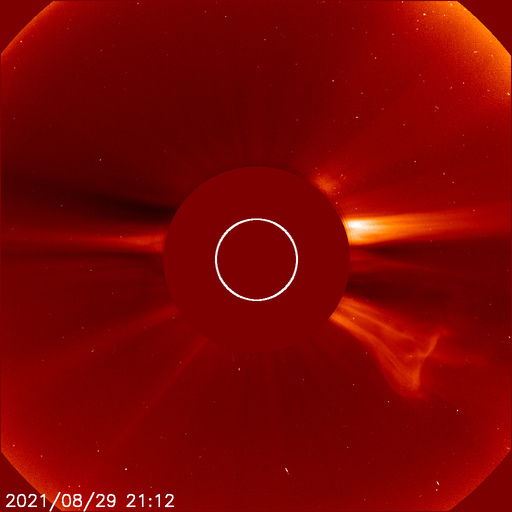
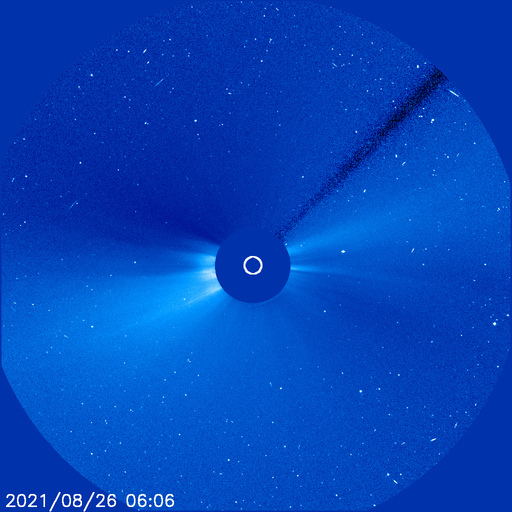

# Archive: August 2021

List of archived image observations from LASCO C2 and LASCO C3 published on Space Weather Prediction Center [website](https://www.swpc.noaa.gov/products/lasco-coronagraph) during the month August 2021.

### 2021-08-31

*CACTUS: <a href="https://www.sidc.be/cactus/catalog/LASCO/2_5_0/qkl/2021/08/CME0056/CME.html">CME0056</a> // SEEDS: <a href="http://spaceweather.gmu.edu/seeds/dailymkmovie.php?cme=20210831&r&cor2=a">COR2</a> & <a href="http://spaceweather.gmu.edu/seeds/dailymkmovie.php?cme=20210831&cor2=a">COR2A</a>*

   

### 2021-08-30

### 2021-08-29

*CACTUS: <a href="https://www.sidc.be/cactus/catalog/LASCO/2_5_0/qkl/2021/08/CME0051/CME.html">CME0051</a>, <a href="https://www.sidc.be/cactus/catalog/LASCO/2_5_0/qkl/2021/08/CME0052/CME.html">CME0052</a> // SEEDS: <a href="http://spaceweather.gmu.edu/seeds/dailymkmovie.php?cme=20210829&r&cor2=a">COR2</a> & <a href="http://spaceweather.gmu.edu/seeds/dailymkmovie.php?cme=20210829&cor2=a">COR2A</a>*

        

### 2021-08-28

*CACTUS: <a href="https://www.sidc.be/cactus/catalog/LASCO/2_5_0/qkl/2021/08/CME0046/CME.html">CME0046</a>, <a href="https://www.sidc.be/cactus/catalog/LASCO/2_5_0/qkl/2021/08/CME0049/CME.html">CME0049</a> // SEEDS: <a href="http://spaceweather.gmu.edu/seeds/dailymkmovie.php?cme=20210828&r&cor2=a">COR2</a> & <a href="http://spaceweather.gmu.edu/seeds/dailymkmovie.php?cme=20210828&cor2=a">COR2A</a>*

             

### 2021-08-26

    

### 2021-08-24

*CACTUS: <a href="https://www.sidc.be/cactus/catalog/LASCO/2_5_0/qkl/2021/08/CME0034/CME.html">CME0034</a> // SEEDS: <a href="http://spaceweather.gmu.edu/seeds/dailymkmovie.php?cme=20210824&r&cor2=a">COR2</a> & <a href="http://spaceweather.gmu.edu/seeds/dailymkmovie.php?cme=20210824&cor2=a">COR2A</a>*

               

### 2021-08-20

*CACTUS: <a href="https://www.sidc.be/cactus/catalog/LASCO/2_5_0/qkl/2021/08/CME0021/CME.html">CME0021</a> // SEEDS: <a href="http://spaceweather.gmu.edu/seeds/dailymkmovie.php?cme=20210820&r&cor2=a">COR2</a> & <a href="http://spaceweather.gmu.edu/seeds/dailymkmovie.php?cme=20210820&cor2=a">COR2A</a>*

      

### 2021-08-19

      

### 2021-08-18

      

### 2021-08-02

 
