# Archive: December 2021

List of archived image observations from LASCO C2 and LASCO C3 published on Space Weather Prediction Center [website](https://www.swpc.noaa.gov/products/lasco-coronagraph) during the month December 2021.

### 2021-12-24

*CACTUS: <a href="https://www.sidc.be/cactus/catalog/LASCO/2_5_0/qkl/2021/12/CME0059/CME.html">CME0059</a> // SEEDS: <a href="http://spaceweather.gmu.edu/seeds/dailymkmovie.php?cme=20211224&r&cor2=a">COR2</a> & <a href="http://spaceweather.gmu.edu/seeds/dailymkmovie.php?cme=20211224&cor2=a">COR2A</a>*

 <a href="img/20211224-02.png">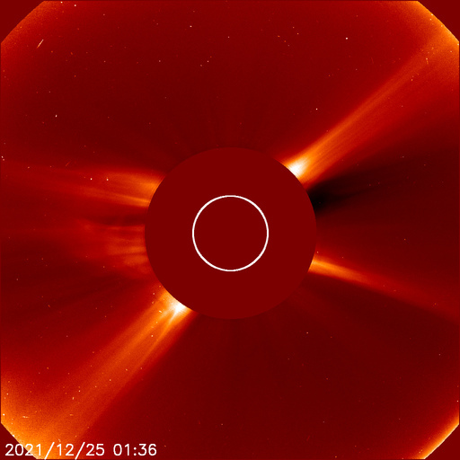</a> <a href="img/20211224-03.png">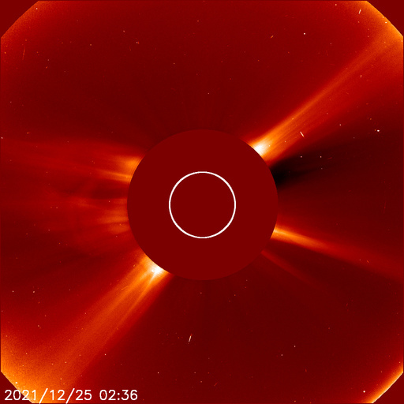</a> <a href="img/20211224-04.png">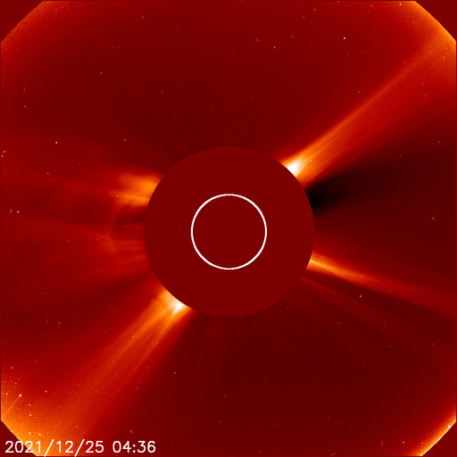</a> <a href="img/20211224-05.png">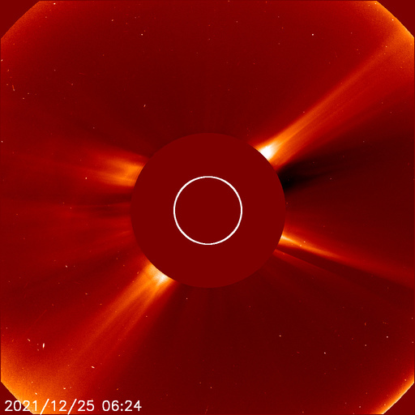</a>

### 2021-12-18

*CACTUS: <a href="https://www.sidc.be/cactus/catalog/LASCO/2_5_0/qkl/2021/12/CME0043/CME.html">CME0043</a> // SEEDS: <a href="http://spaceweather.gmu.edu/seeds/dailymkmovie.php?cme=20211218&r&cor2=a">COR2</a> & <a href="http://spaceweather.gmu.edu/seeds/dailymkmovie.php?cme=20211218&cor2=a">COR2A</a>*

<a href="img/20211218-01.png">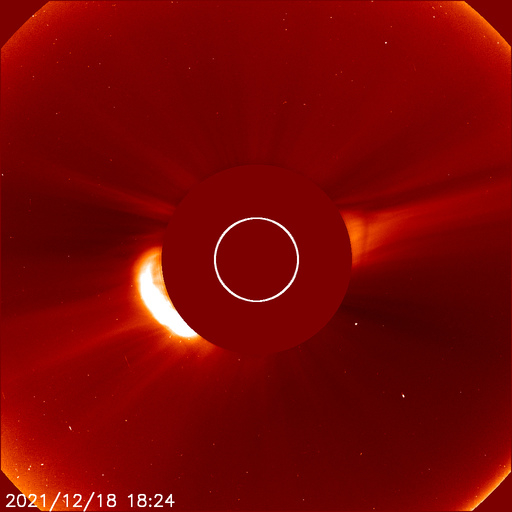</a>  <a href="img/20211218-03.png">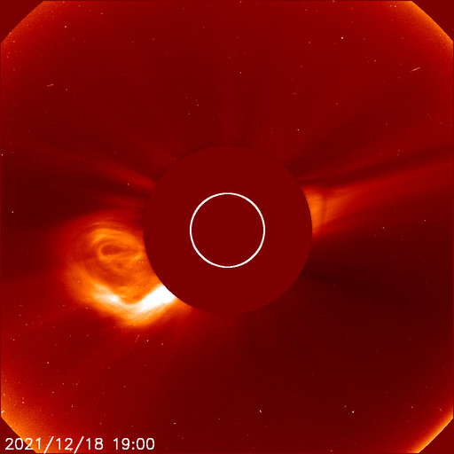</a> <a href="img/20211218-04.png">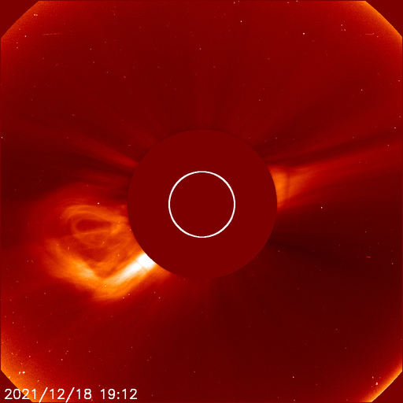</a> <a href="img/20211218-05.png">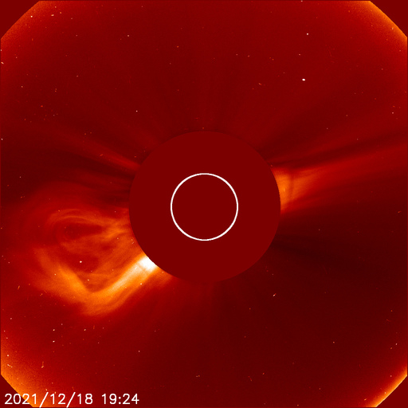</a> <a href="img/20211218-06.png">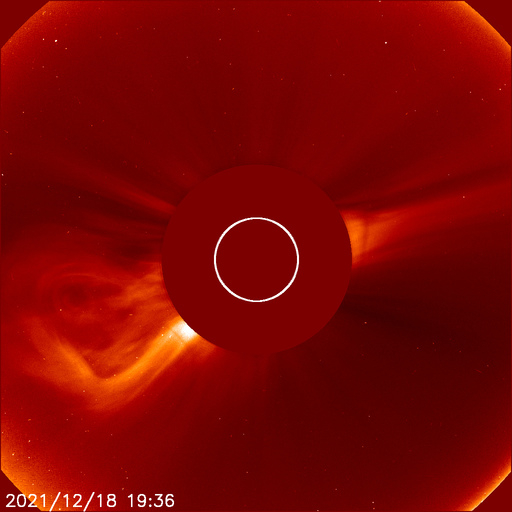</a> <a href="img/20211218-07.png">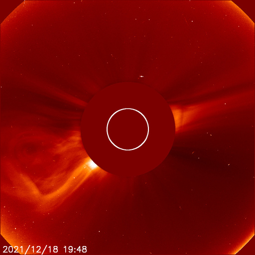</a> <a href="img/20211218-08.png">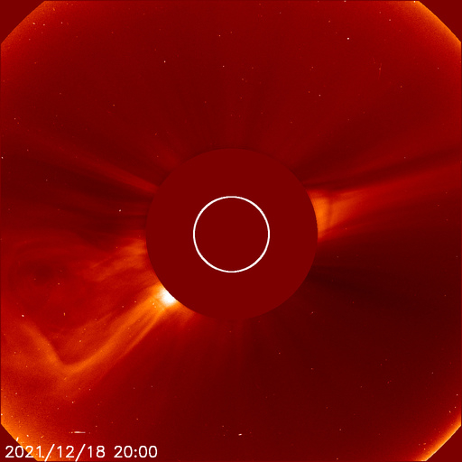</a> <a href="img/20211218-09.png">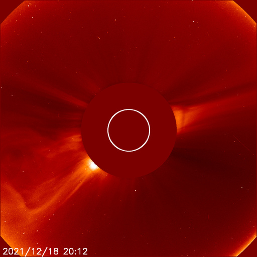</a> <a href="img/20211218-10.png">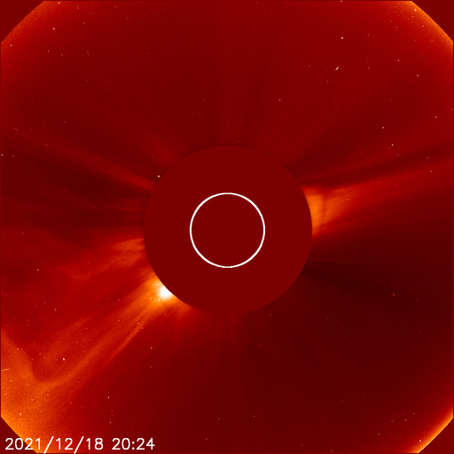</a>

### 2021-12-16

*CACTUS: <a href="https://www.sidc.be/cactus/catalog/LASCO/2_5_0/qkl/2021/12/CME0041/CME.html">CME0041</a> // SEEDS: <a href="http://spaceweather.gmu.edu/seeds/dailymkmovie.php?cme=20211216&r&cor2=a">COR2</a> & <a href="http://spaceweather.gmu.edu/seeds/dailymkmovie.php?cme=20211216&cor2=a">COR2A</a>*

<a href="img/20211216-01.png">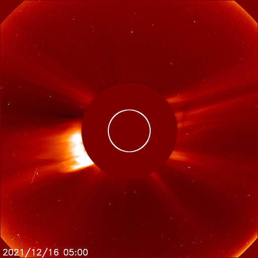</a> <a href="img/20211216-02.png">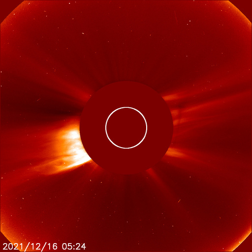</a> <a href="img/20211216-03.png">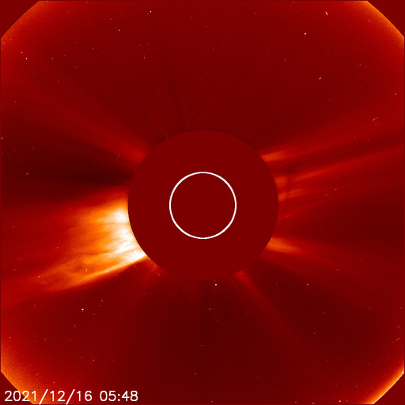</a> <a href="img/20211216-04.png">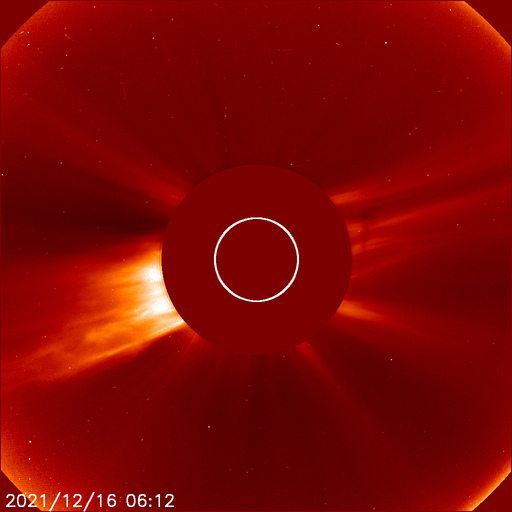</a> <a href="img/20211216-05.png">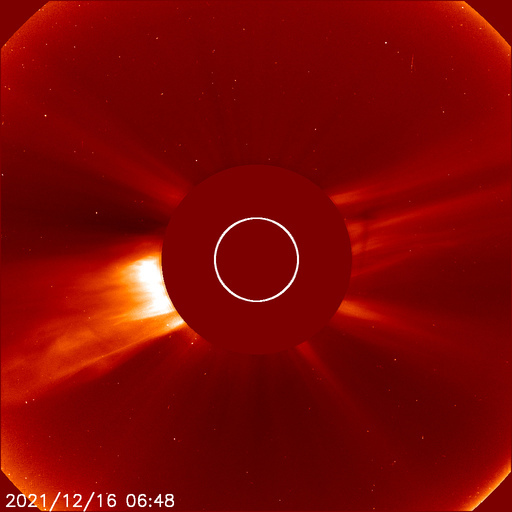</a>

### 2021-12-05

*CACTUS: <a href="https://www.sidc.be/cactus/catalog/LASCO/2_5_0/qkl/2021/12/CME0014/CME.html">CME0014</a>, <a href="https://www.sidc.be/cactus/catalog/LASCO/2_5_0/qkl/2021/12/CME0015/CME.html">CME0015</a> // SEEDS: <a href="http://spaceweather.gmu.edu/seeds/dailymkmovie.php?cme=20211205&r&cor2=a">COR2</a> & <a href="http://spaceweather.gmu.edu/seeds/dailymkmovie.php?cme=20211205&cor2=a">COR2A</a>*

<a href="img/20211205-01.png">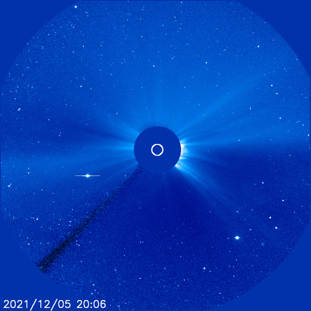</a> <a href="img/20211205-02.png">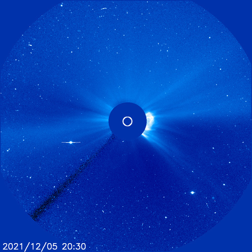</a> <a href="img/20211205-03.png">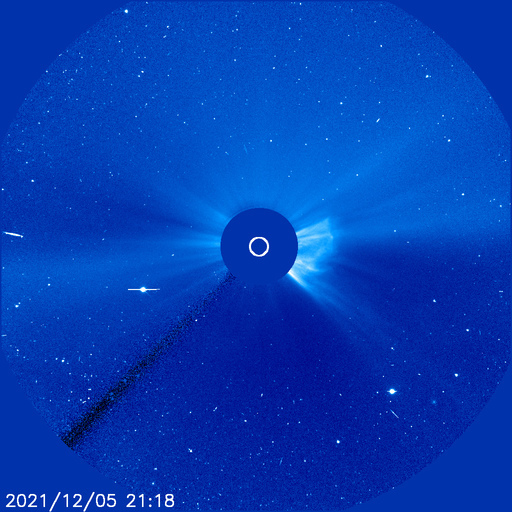</a> <a href="img/20211205-04.png">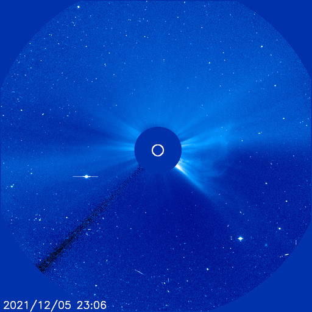</a> <a href="img/20211205-05.png">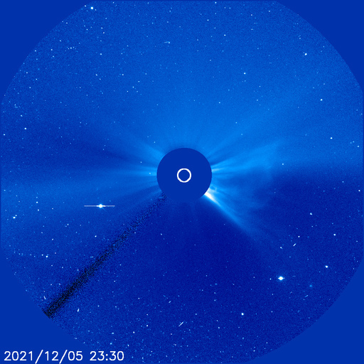</a>  <a href="img/20211205-07.png">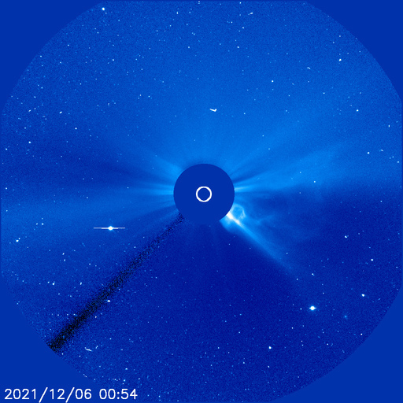</a>   <a href="img/20211205-10.png">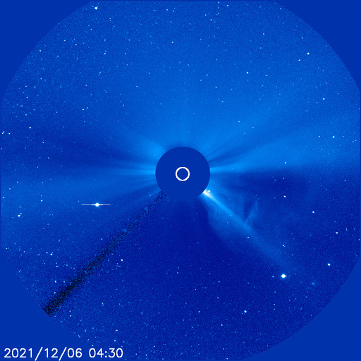</a>

### 2021-12-04

*CACTUS: <a href="https://www.sidc.be/cactus/catalog/LASCO/2_5_0/qkl/2021/12/CME0004/CME.html">CME0004</a>, <a href="https://www.sidc.be/cactus/catalog/LASCO/2_5_0/qkl/2021/12/CME0006/CME.html">CME0006</a> // SEEDS: <a href="http://spaceweather.gmu.edu/seeds/dailymkmovie.php?cme=20211204&r&cor2=a">COR2</a> & <a href="http://spaceweather.gmu.edu/seeds/dailymkmovie.php?cme=20211204&cor2=a">COR2A</a>*

<a href="img/20211204-01.png">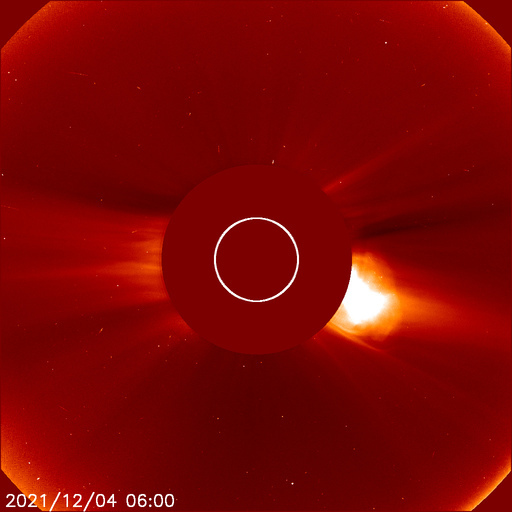</a>  <a href="img/20211204-03.png">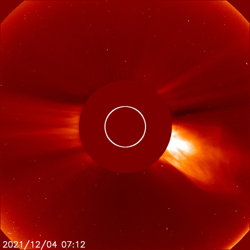</a> <a href="img/20211204-04.png">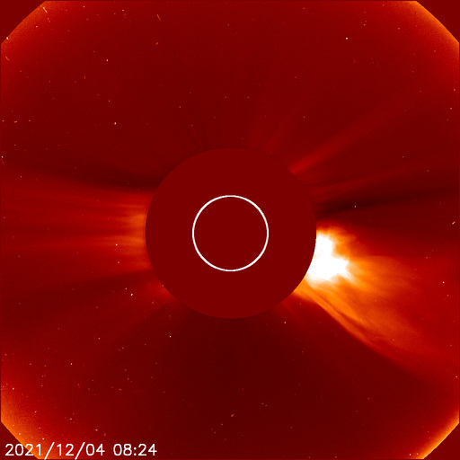</a> <a href="img/20211204-05.png">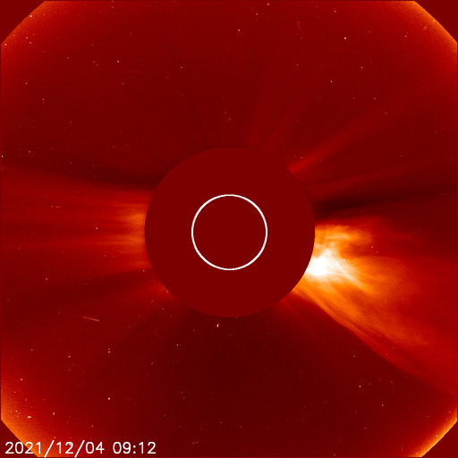</a>  <a href="img/20211204-07.png">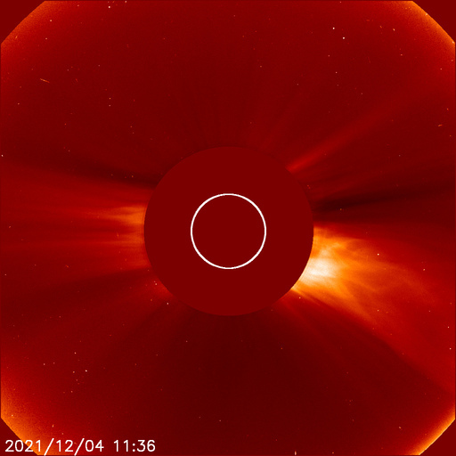</a> <a href="img/20211204-08.png">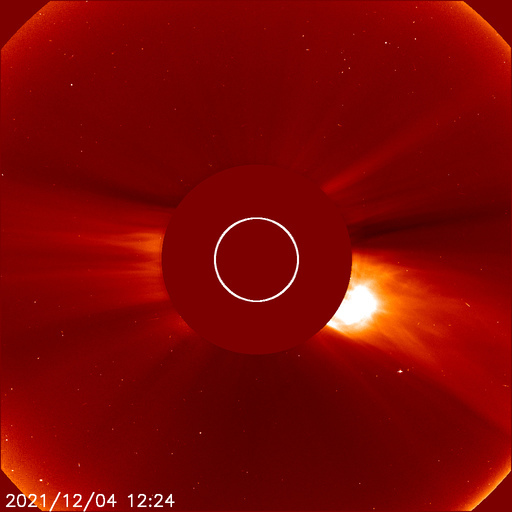</a>  <a href="img/20211204-10.png">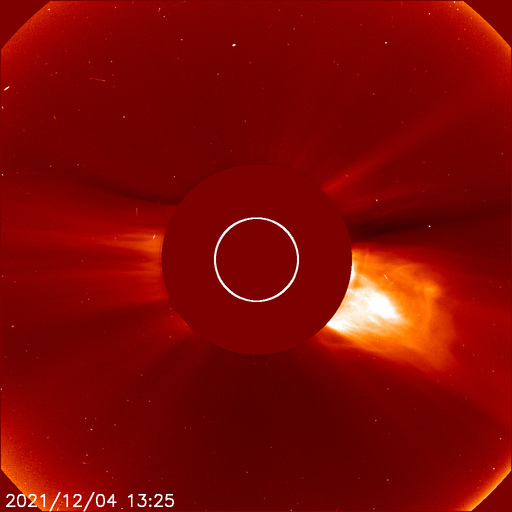</a> <a href="img/20211204-11.png">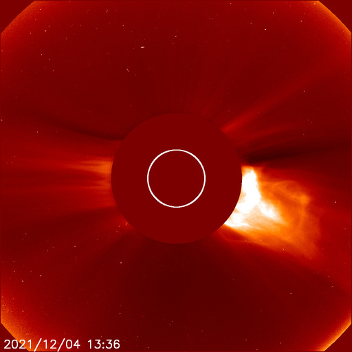</a> <a href="img/20211204-12.png">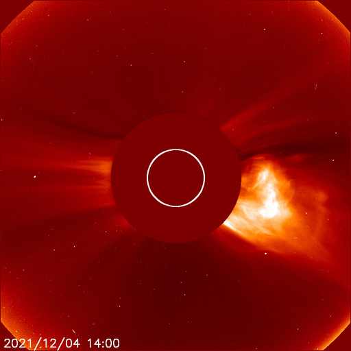</a> <a href="img/20211204-13.png">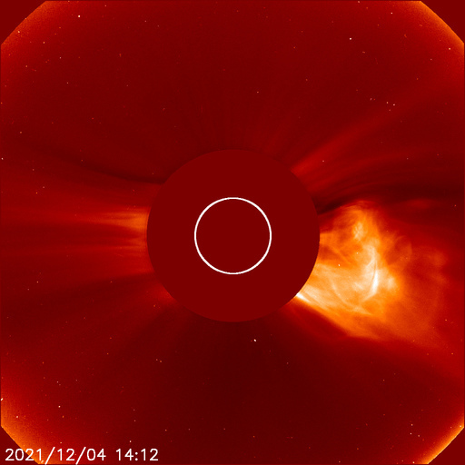</a> <a href="img/20211204-14.png">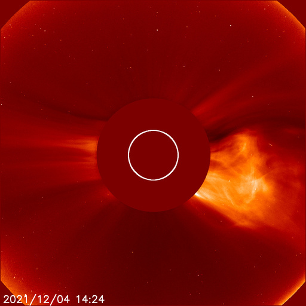</a> <a href="img/20211204-15.png">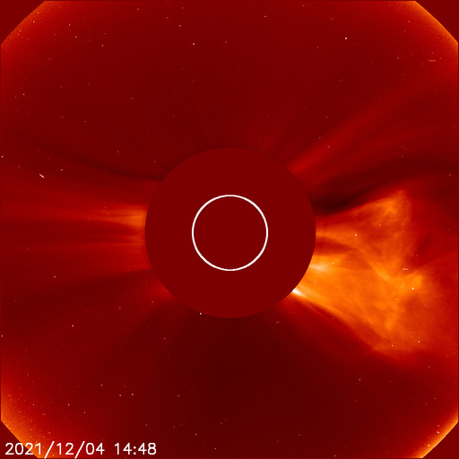</a> <a href="img/20211204-16.png">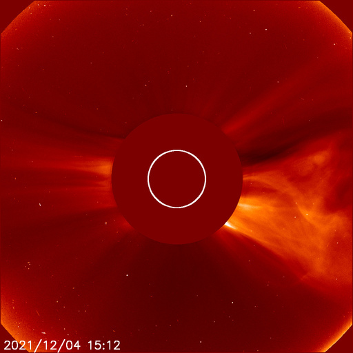</a> <a href="img/20211204-17.png">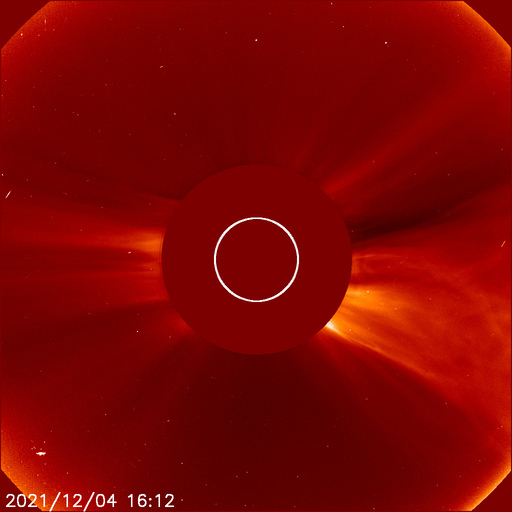</a>
