# Archive: July 2021

List of archived image observations from LASCO C2 and LASCO C3 published on Space Weather Prediction Center [website](https://www.swpc.noaa.gov/products/lasco-coronagraph) during the month July 2021.

### 2021-07-24

*CACTUS: <a href="https://wwwbis.sidc.be/cactus/catalog/LASCO/2_5_0/qkl/2021/07/CME0065/CME.html">CME0065</a> // SEEDS: <a href="http://spaceweather.gmu.edu/seeds/dailymkmovie.php?cme=20210724&r&cor2=a">COR2</a> & <a href="http://spaceweather.gmu.edu/seeds/dailymkmovie.php?cme=20210724&cor2=a">COR2A</a>*

<a href="img/20210724-01.png">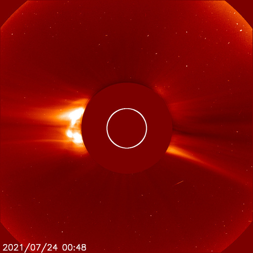</a> <a href="img/20210724-02.png">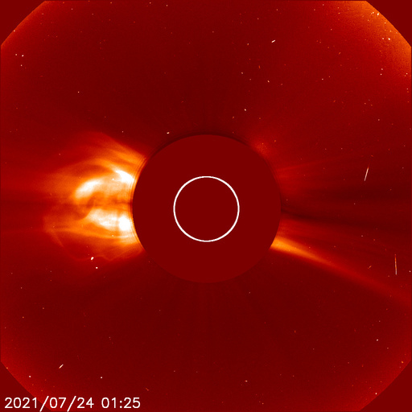</a> <a href="img/20210724-03.png">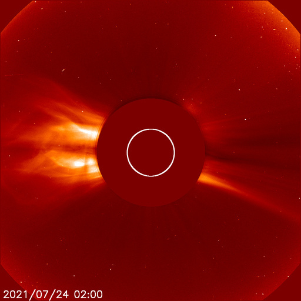</a>

### 2021-07-19

*CACTUS: <a href="https://wwwbis.sidc.be/cactus/catalog/LASCO/2_5_0/qkl/2021/07/CME0054/CME.html">CME0054</a>, <a href="https://wwwbis.sidc.be/cactus/catalog/LASCO/2_5_0/qkl/2021/07/CME0055/CME.html">CME0055</a> // SEEDS: <a href="http://spaceweather.gmu.edu/seeds/dailymkmovie.php?cme=20210719&r&cor2=a">COR2</a> & <a href="http://spaceweather.gmu.edu/seeds/dailymkmovie.php?cme=20210719&cor2=a">COR2A</a>*

<a href="img/20210719-01.png">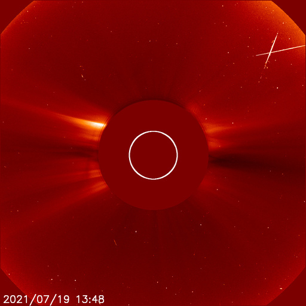</a>   <a href="img/20210719-04.png">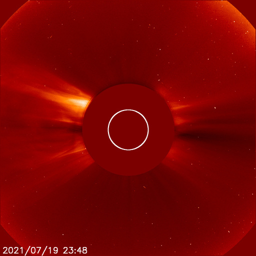</a>

### 2021-07-17

*CACTUS: <a href="https://wwwbis.sidc.be/cactus/catalog/LASCO/2_5_0/qkl/2021/07/CME0044/CME.html">CME0044</a> // SEEDS: <a href="http://spaceweather.gmu.edu/seeds/dailymkmovie.php?cme=20210717&r&cor2=a">COR2</a> & <a href="http://spaceweather.gmu.edu/seeds/dailymkmovie.php?cme=20210717&cor2=a">COR2A</a>*

  <a href="img/20210717-03.png">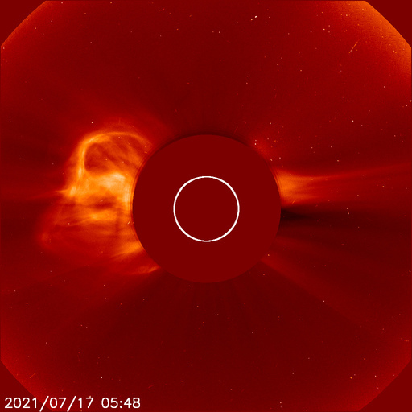</a> <a href="img/20210717-04.png">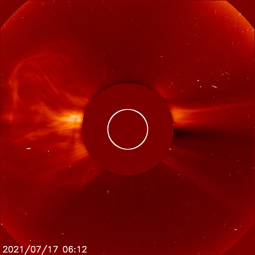</a> <a href="img/20210717-05.png">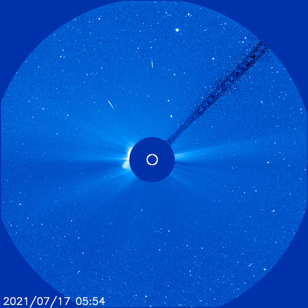</a>  <a href="img/20210717-07.png">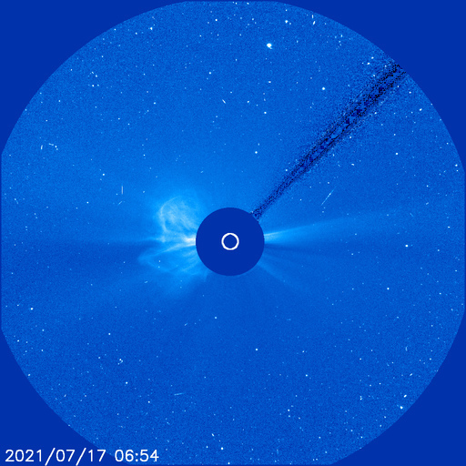</a>

### 2021-07-15

*CACTUS: <a href="https://wwwbis.sidc.be/cactus/catalog/LASCO/2_5_0/qkl/2021/07/CME0036/CME.html">CME0036</a> // SEEDS: <a href="http://spaceweather.gmu.edu/seeds/dailymkmovie.php?cme=20210715&r&cor2=a">COR2</a> & <a href="http://spaceweather.gmu.edu/seeds/dailymkmovie.php?cme=20210715&cor2=a">COR2A</a>*

 <a href="img/20210715-02.png">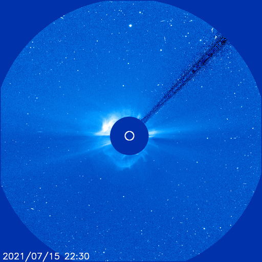</a> <a href="img/20210715-03.png">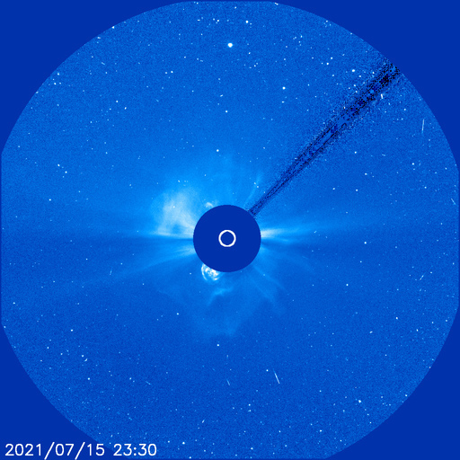</a>     <a href="img/20210715-08.png">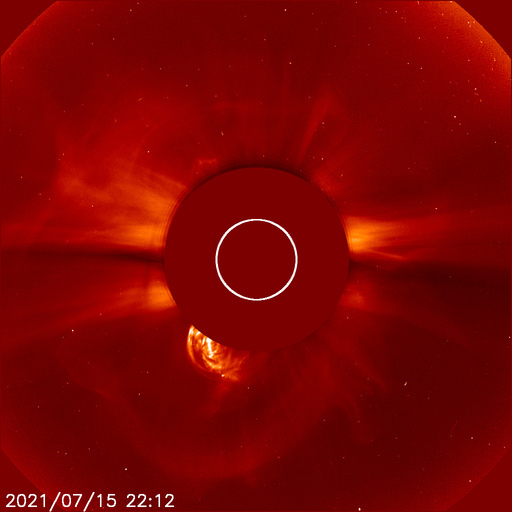</a>  <a href="img/20210715-10.png">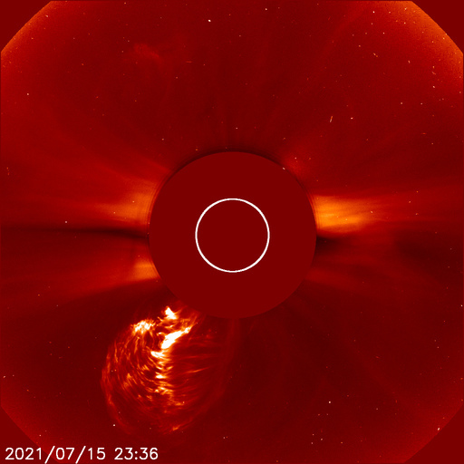</a>  <a href="img/20210715-12.png">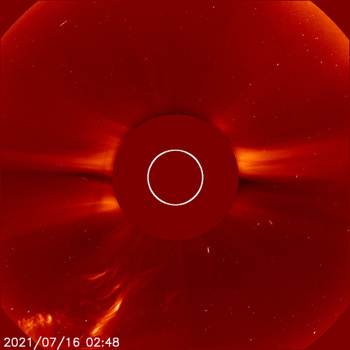</a>

### 2021-07-13

*CACTUS: <a href="https://wwwbis.sidc.be/cactus/catalog/LASCO/2_5_0/qkl/2021/07/CME0028/CME.html">CME0028</a> // SEEDS: <a href="http://spaceweather.gmu.edu/seeds/dailymkmovie.php?cme=20210713&r&cor2=a">COR2</a> & <a href="http://spaceweather.gmu.edu/seeds/dailymkmovie.php?cme=20210713&cor2=a">COR2A</a>*

 <a href="img/20210713-02.png">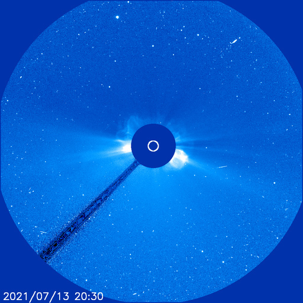</a>     <a href="img/20210713-07.png">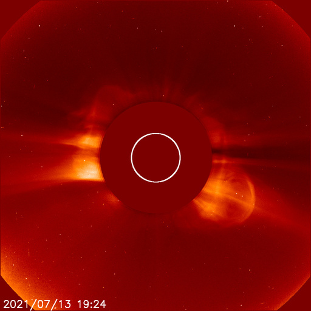</a> <a href="img/20210713-08.png">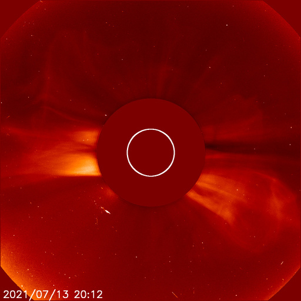</a> 

### 2021-07-12

*CACTUS: <a href="https://wwwbis.sidc.be/cactus/catalog/LASCO/2_5_0/qkl/2021/07/CME0025/CME.html">CME0025</a> // SEEDS: <a href="http://spaceweather.gmu.edu/seeds/dailymkmovie.php?cme=20210712&r&cor2=a">COR2</a> & <a href="http://spaceweather.gmu.edu/seeds/dailymkmovie.php?cme=20210712&cor2=a">COR2A</a>*

 <a href="img/20210712-02.png">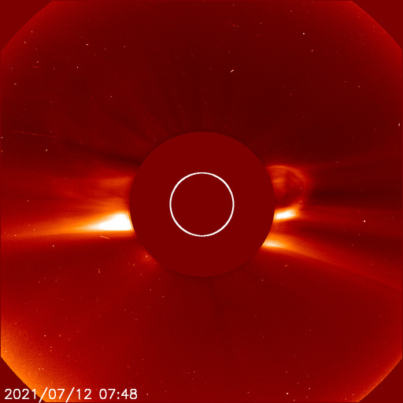</a> <a href="img/20210712-03.png">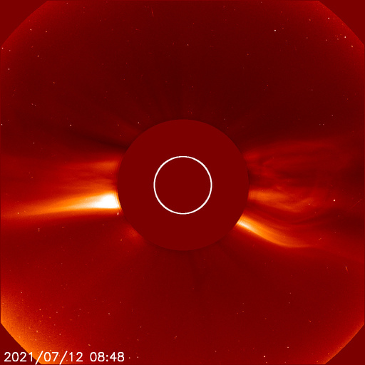</a> 

### 2021-07-09

*CACTUS: <a href="https://wwwbis.sidc.be/cactus/catalog/LASCO/2_5_0/qkl/2021/07/CME0015/CME.html">CME0015</a>, <a href="https://wwwbis.sidc.be/cactus/catalog/LASCO/2_5_0/qkl/2021/07/CME0016/CME.html">CME0016</a> // SEEDS: <a href="http://spaceweather.gmu.edu/seeds/dailymkmovie.php?cme=20210709&r&cor2=a">COR2</a> & <a href="http://spaceweather.gmu.edu/seeds/dailymkmovie.php?cme=20210709&cor2=a">COR2A</a>*

     <a href="img/20210709-06.png">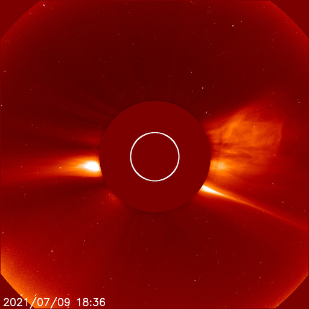</a>    

### 2021-07-07

*CACTUS: <a href="https://wwwbis.sidc.be/cactus/catalog/LASCO/2_5_0/qkl/2021/07/CME0013/CME.html">CME0013</a> // SEEDS: <a href="http://spaceweather.gmu.edu/seeds/dailymkmovie.php?cme=20210707&r&cor2=a">COR2</a> & <a href="http://spaceweather.gmu.edu/seeds/dailymkmovie.php?cme=20210707&cor2=a">COR2A</a>*

<a href="img/20210707-01.png">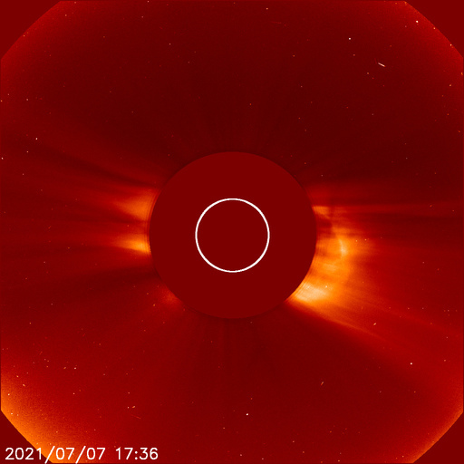</a>  

### 2021-07-06

*CACTUS: <a href="https://wwwbis.sidc.be/cactus/catalog/LASCO/2_5_0/qkl/2021/07/CME0011/CME.html">CME0011</a> // SEEDS: <a href="http://spaceweather.gmu.edu/seeds/dailymkmovie.php?cme=20210706&r&cor2=a">COR2</a> & <a href="http://spaceweather.gmu.edu/seeds/dailymkmovie.php?cme=20210706&cor2=a">COR2A</a>*

<a href="img/20210706-01.png">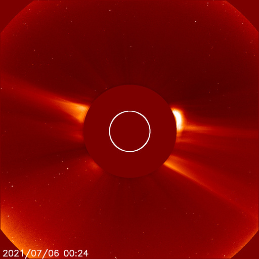</a> <a href="img/20210706-02.png">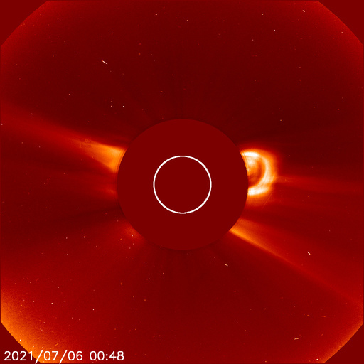</a> <a href="img/20210706-03.png">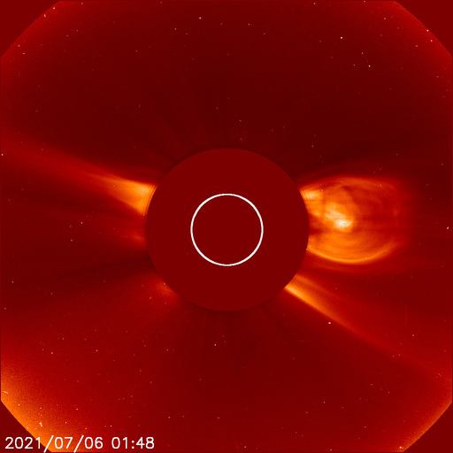</a> <a href="img/20210706-04.png">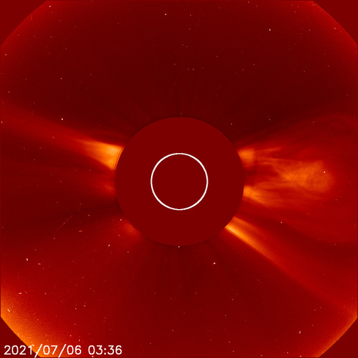</a> <a href="img/20210706-05.png">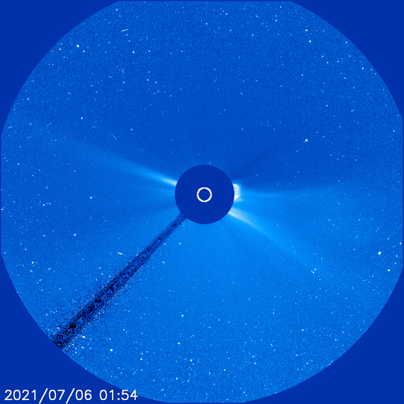</a>  <a href="img/20210706-07.png">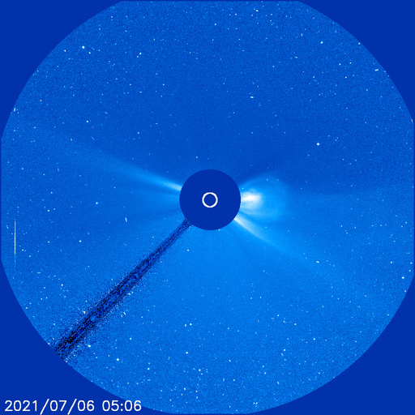</a> <a href="img/20210706-08.png">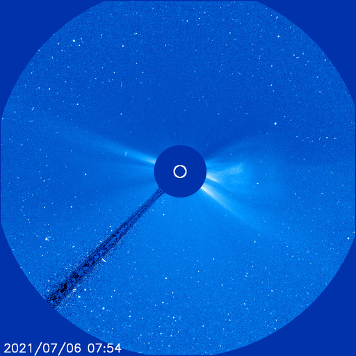</a>

### 2021-07-03

*CACTUS: <a href="https://wwwbis.sidc.be/cactus/catalog/LASCO/2_5_0/qkl/2021/07/CME0008/CME.html">CME0008</a> // SEEDS: <a href="http://spaceweather.gmu.edu/seeds/dailymkmovie.php?cme=20210703&r&cor2=a">COR2</a> & <a href="http://spaceweather.gmu.edu/seeds/dailymkmovie.php?cme=20210703&cor2=a">COR2A</a>*

### 2021-07-02

*CACTUS: <a href="https://wwwbis.sidc.be/cactus/catalog/LASCO/2_5_0/qkl/2021/07/CME0002/CME.html">CME0002</a> // SEEDS: <a href="http://spaceweather.gmu.edu/seeds/dailymkmovie.php?cme=20210702&r&cor2=a">COR2</a> & <a href="http://spaceweather.gmu.edu/seeds/dailymkmovie.php?cme=20210702&cor2=a">COR2A</a>*

    <a href="img/20210702-05.png">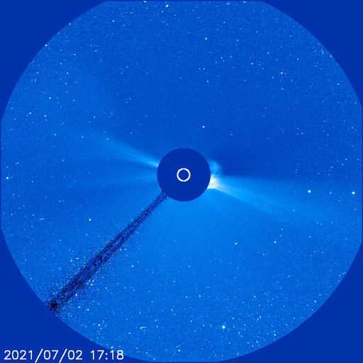</a> <a href="img/20210702-06.png">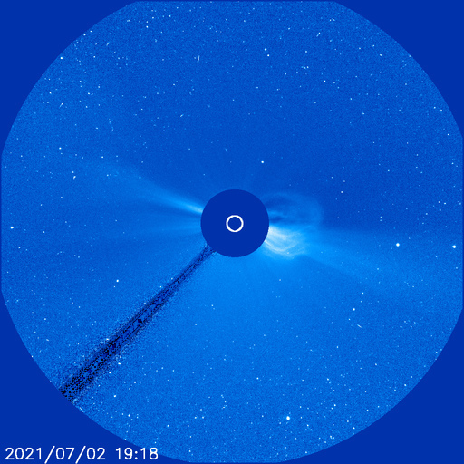</a>  <a href="img/20210702-08.png">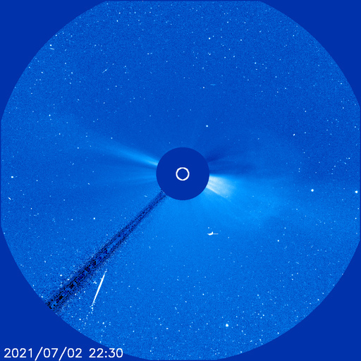</a>
