# Archive: June 2021

List of archived image observations from LASCO C2 and LASCO C3 published on Space Weather Prediction Center [website](https://www.swpc.noaa.gov/products/lasco-coronagraph) during the month June 2021.

### 2021-06-30

 

### 2021-06-29

### 2021-06-28

  <a href="img/20210628-03.png">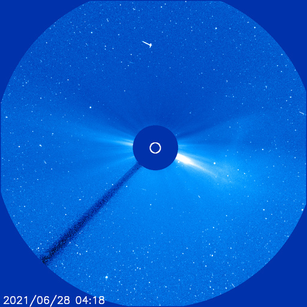</a>  

### 2021-06-27

*CACTUS: <a href="https://wwwbis.sidc.be/cactus/catalog/LASCO/2_5_0/qkl/2021/06/CME0044/CME.html">CME0044</a>, <a href="https://wwwbis.sidc.be/cactus/catalog/LASCO/2_5_0/qkl/2021/06/CME0045/CME.html">CME0045</a> // SEEDS: <a href="http://spaceweather.gmu.edu/seeds/dailymkmovie.php?cme=20210627&r&cor2=a">COR2</a> & <a href="http://spaceweather.gmu.edu/seeds/dailymkmovie.php?cme=20210627&cor2=a">COR2A</a>*

<a href="img/20210627-01.png">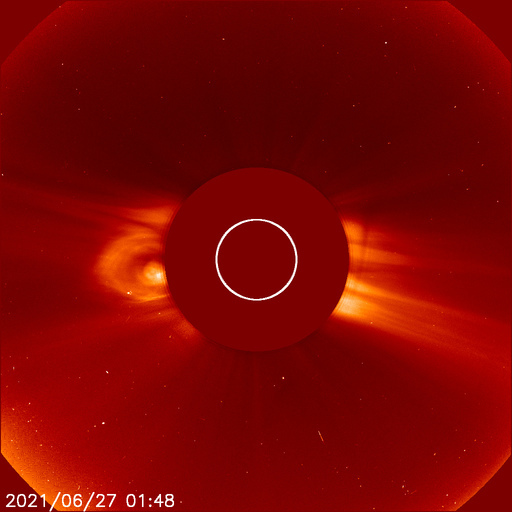</a> <a href="img/20210627-02.png">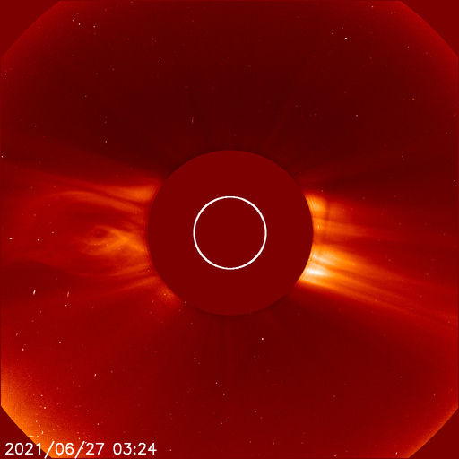</a>   <a href="img/20210627-05.png">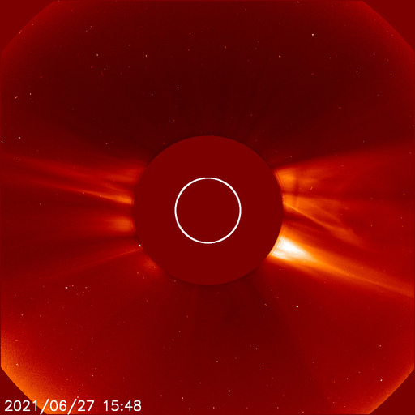</a>

### 2021-06-26

### 2021-06-23

*CACTUS: <a href="https://wwwbis.sidc.be/cactus/catalog/LASCO/2_5_0/qkl/2021/06/CME0035/CME.html">CME0035</a> // SEEDS: <a href="http://spaceweather.gmu.edu/seeds/dailymkmovie.php?cme=20210623&r&cor2=a">COR2</a> & <a href="http://spaceweather.gmu.edu/seeds/dailymkmovie.php?cme=20210623&cor2=a">COR2A</a>*

 <a href="img/20210623-02.png">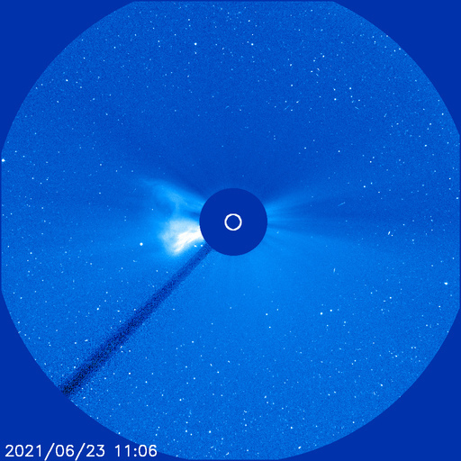</a>  <a href="img/20210623-04.png">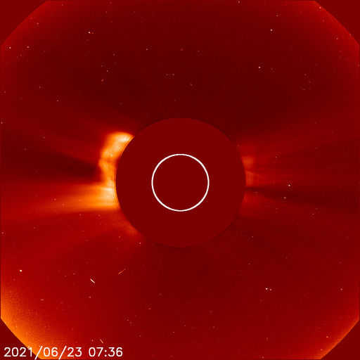</a>  <a href="img/20210623-06.png">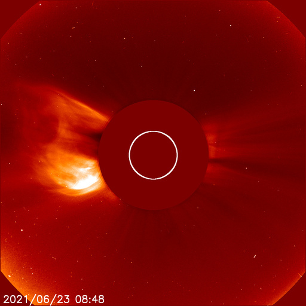</a>  <a href="img/20210623-08.png">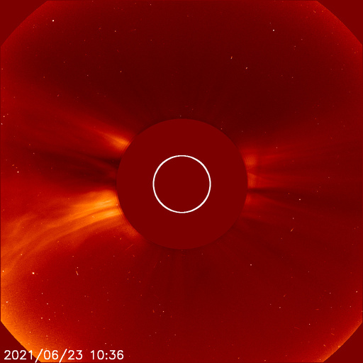</a>

### 2021-06-15

<a href="img/20210615-01.png">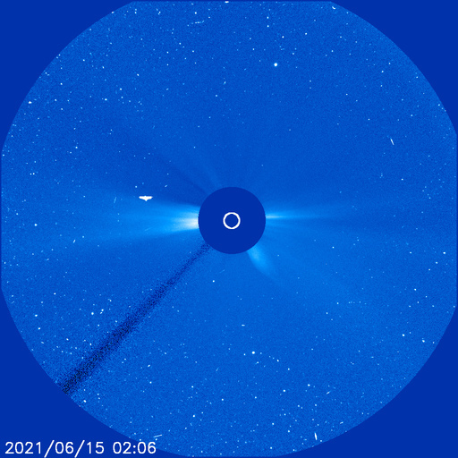</a>

### 2021-06-10

*CACTUS: <a href="https://wwwbis.sidc.be/cactus/catalog/LASCO/2_5_0/qkl/2021/06/CME0018/CME.html">CME0018</a> // SEEDS: <a href="http://spaceweather.gmu.edu/seeds/dailymkmovie.php?cme=20210610&r&cor2=a">COR2</a> & <a href="http://spaceweather.gmu.edu/seeds/dailymkmovie.php?cme=20210610&cor2=a">COR2A</a>*

   <a href="img/20210610-04.png">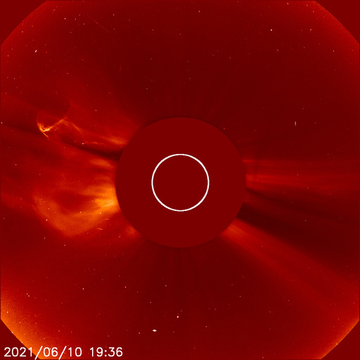</a> 

### 2021-06-08

<a href="img/20210608-01.png">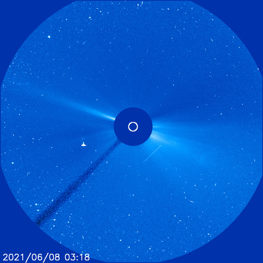</a>
