# Archive: November 2021

List of archived image observations from LASCO C2 and LASCO C3 published on Space Weather Prediction Center [website](https://www.swpc.noaa.gov/products/lasco-coronagraph) during the month November 2021.

### 2021-11-01

<a href="img/20211101-01.png">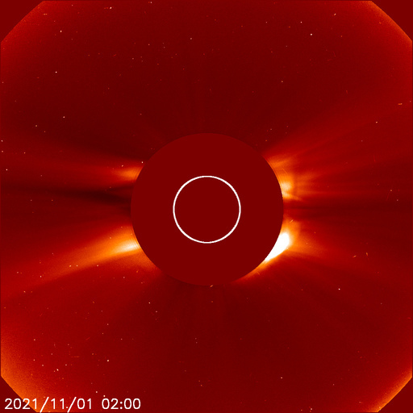</a> <a href="img/20211101-02.png">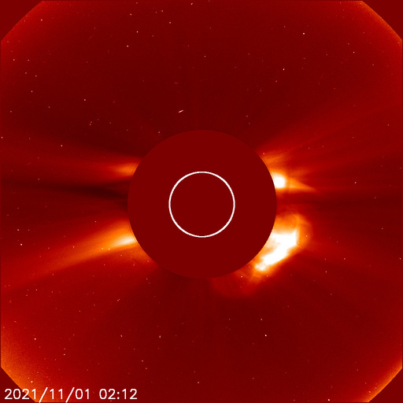</a> <a href="img/20211101-03.png">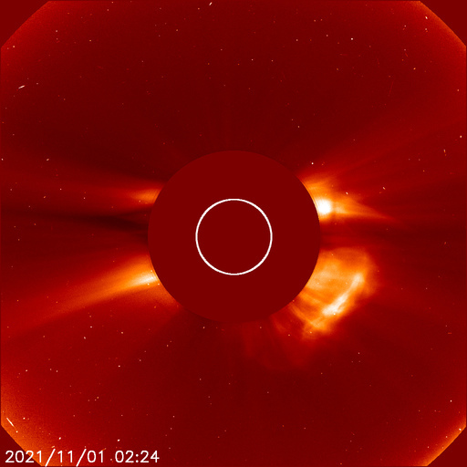</a> <a href="img/20211101-04.png">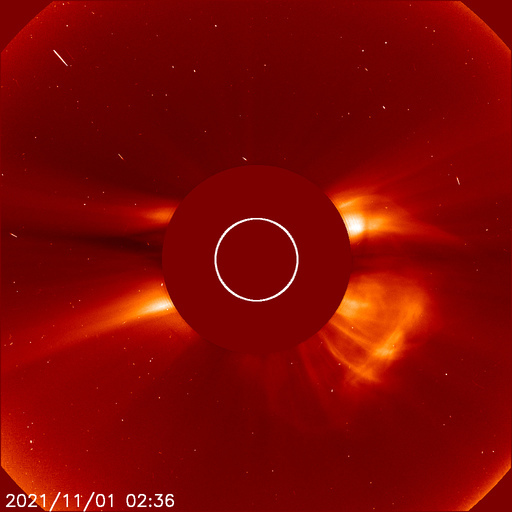</a> <a href="img/20211101-05.png">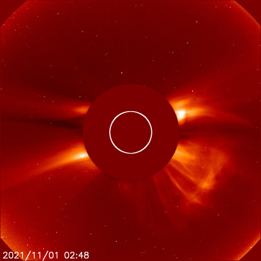</a> <a href="img/20211101-06.png">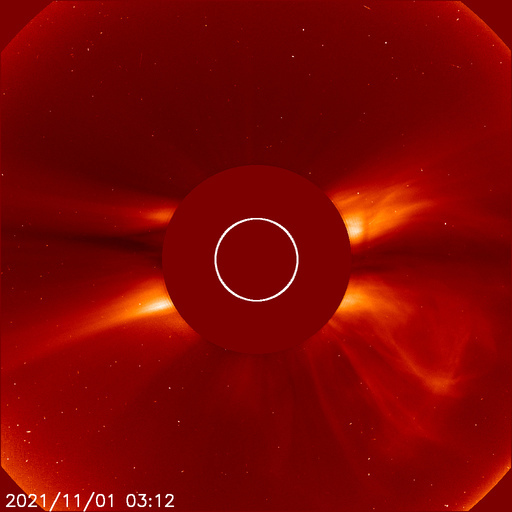</a> <a href="img/20211101-07.png">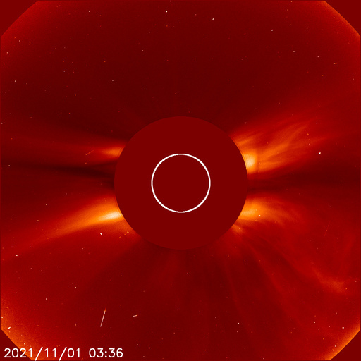</a> <a href="img/20211101-08.png">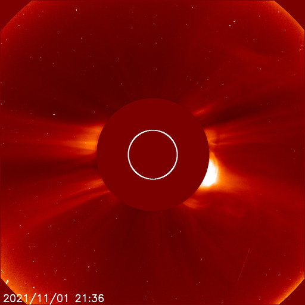</a> <a href="img/20211101-09.png">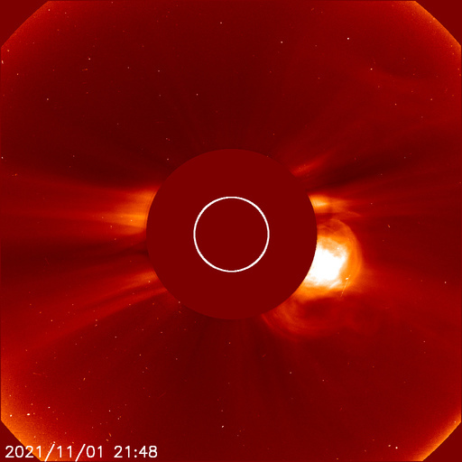</a> <a href="img/20211101-10.png">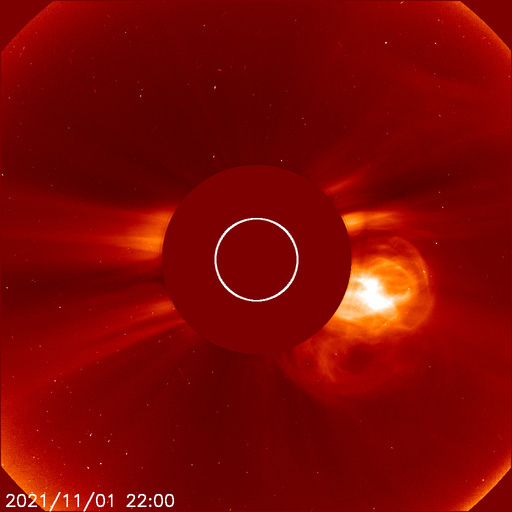</a> <a href="img/20211101-11.png">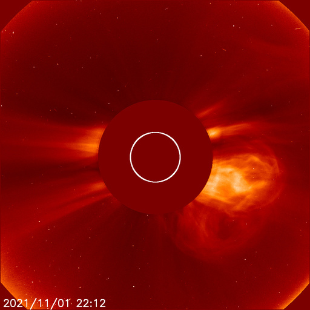</a> <a href="img/20211101-12.png">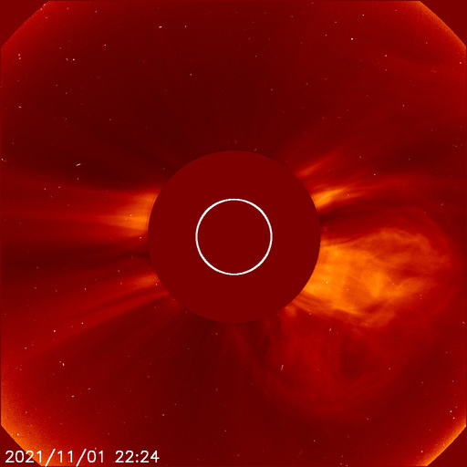</a> <a href="img/20211101-13.png">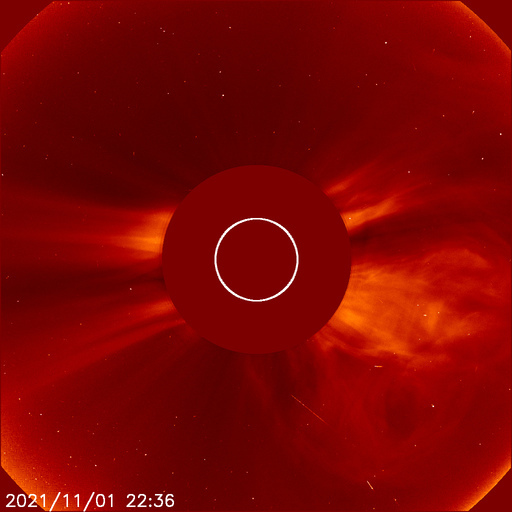</a> <a href="img/20211101-14.png">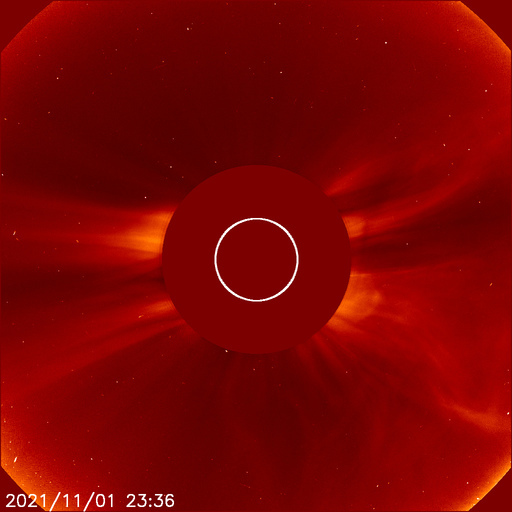</a> <a href="img/20211101-15.png">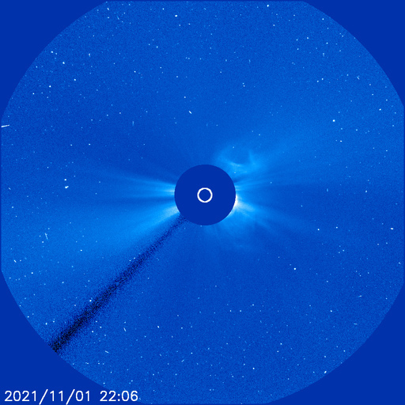</a> <a href="img/20211101-16.png">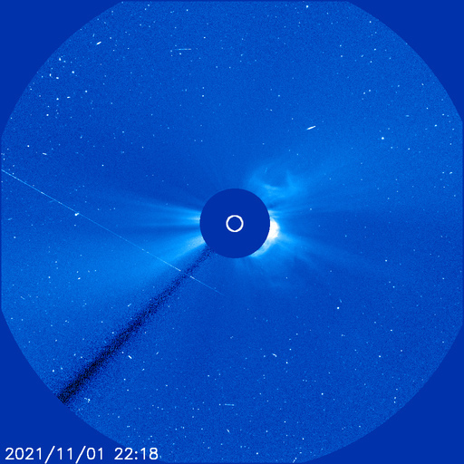</a> <a href="img/20211101-17.png">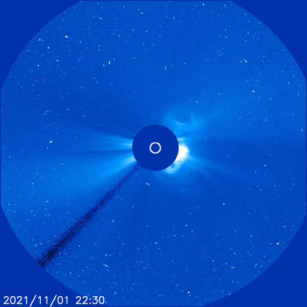</a> <a href="img/20211101-18.png">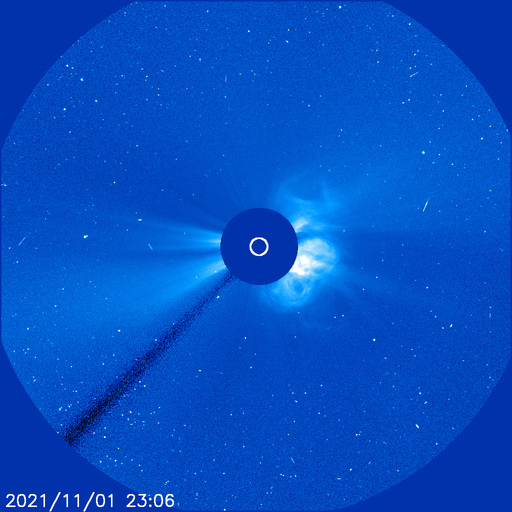</a> <a href="img/20211101-19.png">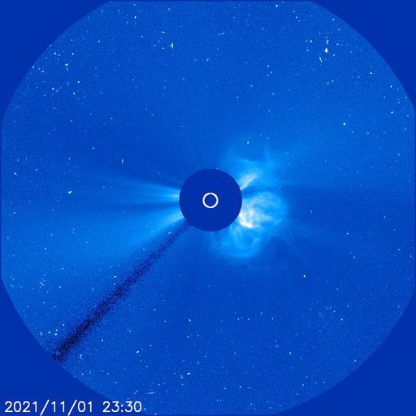</a> <a href="img/20211101-20.png">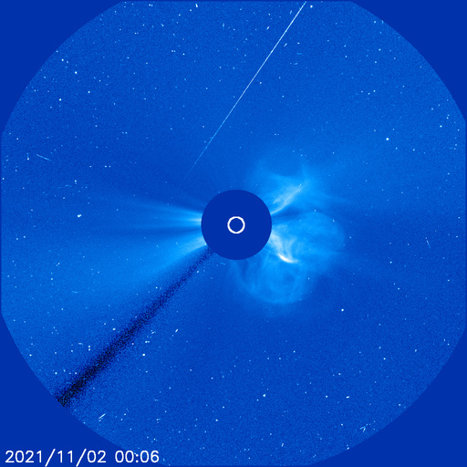</a>
