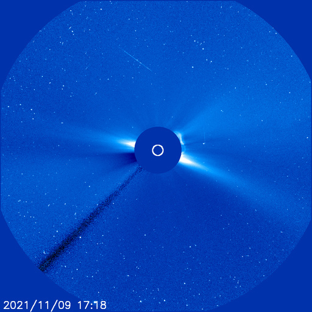

# Archive: November 2021

List of archived image observations from LASCO C2 and LASCO C3 published on Space Weather Prediction Center [website](https://www.swpc.noaa.gov/products/lasco-coronagraph) during the month November 2021.

### 2021-11-25

*CACTUS: <a href="https://www.sidc.be/cactus/catalog/LASCO/2_5_0/qkl/2021/11/CME0056/CME.html">CME0056</a> // SEEDS: <a href="http://spaceweather.gmu.edu/seeds/dailymkmovie.php?cme=20211125&r&cor2=a">COR2</a> & <a href="http://spaceweather.gmu.edu/seeds/dailymkmovie.php?cme=20211125&cor2=a">COR2A</a>*

         

### 2021-11-09

*CACTUS: <a href="https://www.sidc.be/cactus/catalog/LASCO/2_5_0/qkl/2021/11/CME0035/CME.html">CME0035</a> // SEEDS: <a href="http://spaceweather.gmu.edu/seeds/dailymkmovie.php?cme=20211109&r&cor2=a">COR2</a> & <a href="http://spaceweather.gmu.edu/seeds/dailymkmovie.php?cme=20211109&cor2=a">COR2A</a>*

         

### 2021-11-03

*CACTUS: <a href="https://www.sidc.be/cactus/catalog/LASCO/2_5_0/qkl/2021/11/CME0015/CME.html">CME0015</a>, <a href="https://www.sidc.be/cactus/catalog/LASCO/2_5_0/qkl/2021/11/CME0018/CME.html">CME0018</a> // SEEDS: <a href="http://spaceweather.gmu.edu/seeds/dailymkmovie.php?cme=20211103&r&cor2=a">COR2</a> & <a href="http://spaceweather.gmu.edu/seeds/dailymkmovie.php?cme=20211103&cor2=a">COR2A</a>*

         

### 2021-11-02

*CACTUS: <a href="https://www.sidc.be/cactus/catalog/LASCO/2_5_0/qkl/2021/11/CME0011/CME.html">CME0011</a> // SEEDS: <a href="http://spaceweather.gmu.edu/seeds/dailymkmovie.php?cme=20211102&r&cor2=a">COR2</a> & <a href="http://spaceweather.gmu.edu/seeds/dailymkmovie.php?cme=20211102&cor2=a">COR2A</a>*

    

### 2021-11-01

*CACTUS: <a href="https://www.sidc.be/cactus/catalog/LASCO/2_5_0/qkl/2021/11/CME0001/CME.html">CME0001</a>, <a href="https://www.sidc.be/cactus/catalog/LASCO/2_5_0/qkl/2021/11/CME0007/CME.html">CME0007</a> // SEEDS: <a href="http://spaceweather.gmu.edu/seeds/dailymkmovie.php?cme=20211101&r&cor2=a">COR2</a> & <a href="http://spaceweather.gmu.edu/seeds/dailymkmovie.php?cme=20211101&cor2=a">COR2A</a>*

                   
