# Archive: October 2021

List of archived image observations from LASCO C2 and LASCO C3 published on Space Weather Prediction Center [website](https://www.swpc.noaa.gov/products/lasco-coronagraph) during the month October 2021.

### 2021-10-10

<a href="img/20211010-01.png">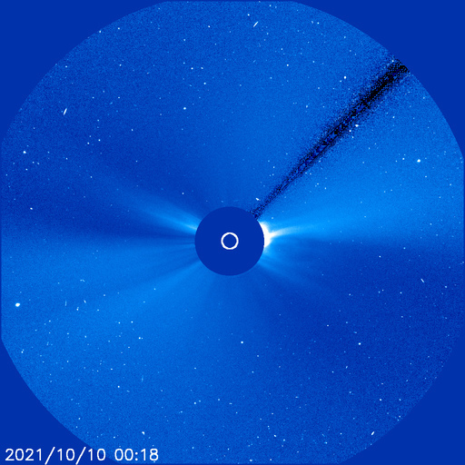</a> <a href="img/20211010-02.png">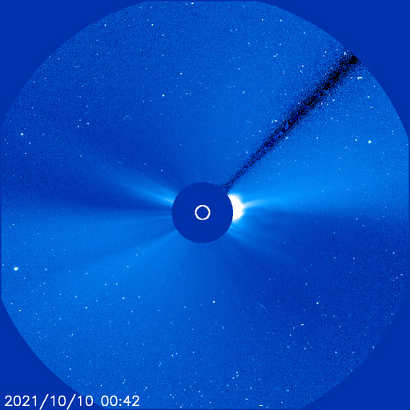</a> <a href="img/20211010-03.png">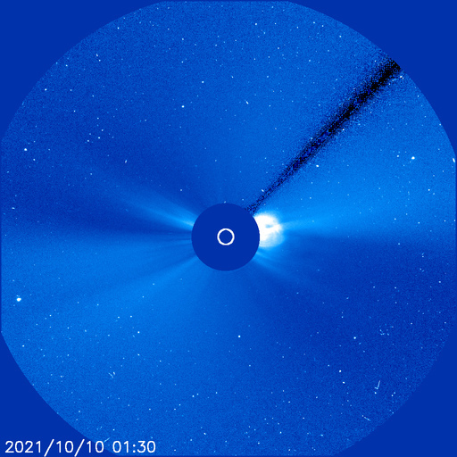</a> <a href="img/20211010-04.png">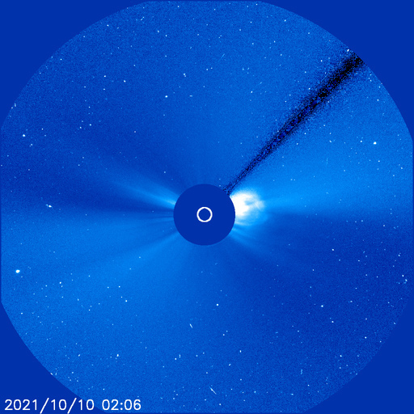</a>  <a href="img/20211010-06.png">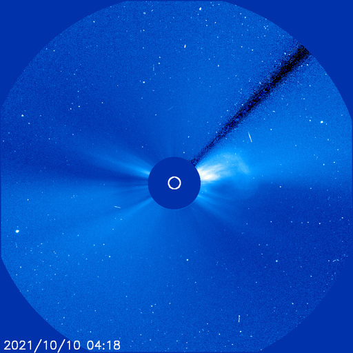</a> <a href="img/20211010-07.png">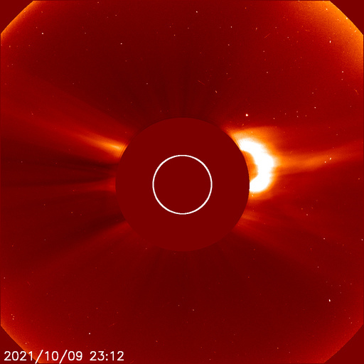</a> <a href="img/20211010-08.png">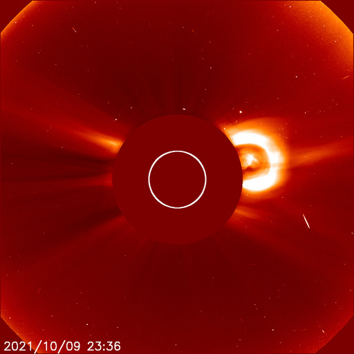</a> <a href="img/20211010-09.png">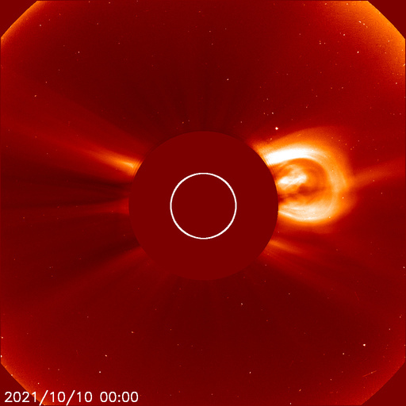</a> <a href="img/20211010-10.png">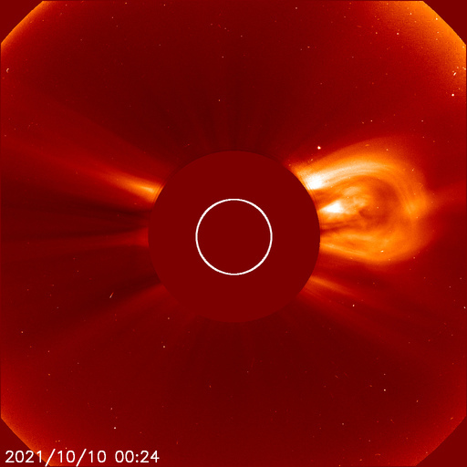</a> <a href="img/20211010-11.png">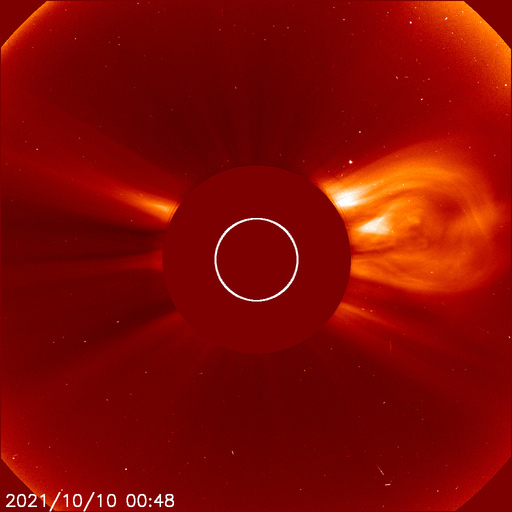</a> <a href="img/20211010-12.png">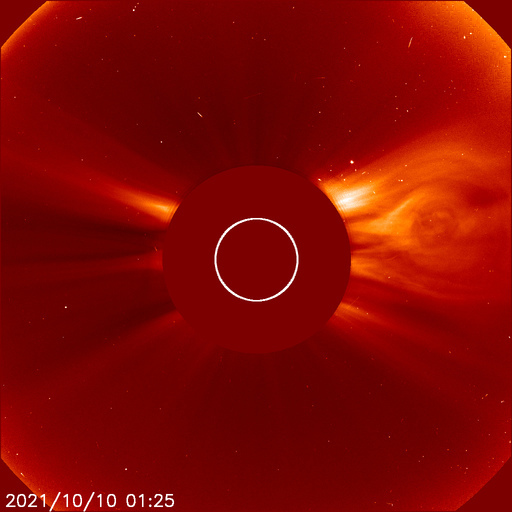</a> <a href="img/20211010-13.png">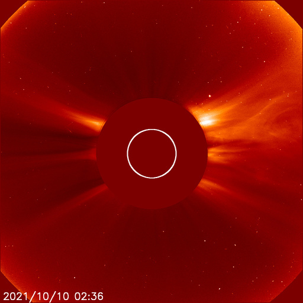</a>

### 2021-10-09

Full halo CME that was associated with an M1/2B flare from Region 2882 (N17, L=157) on 09 October at 0638 UTC.

*CACTUS: <a href="https://wwwbis.sidc.be/cactus/catalog/LASCO/2_5_0/qkl/2021/10/CME0014/CME.html">CME0014</a>, <a href="https://wwwbis.sidc.be/cactus/catalog/LASCO/2_5_0/qkl/2021/10/CME0015/CME.html">CME0015</a>, <a href="https://wwwbis.sidc.be/cactus/catalog/LASCO/2_5_0/qkl/2021/10/CME0016/CME.html">CME0016</a> // SEEDS: <a href="http://spaceweather.gmu.edu/seeds/dailymkmovie.php?cme=20211009&r&cor2=a">COR2</a> & <a href="http://spaceweather.gmu.edu/seeds/dailymkmovie.php?cme=20211009&cor2=a">COR2A</a>*

<a href="img/20211009-01.png">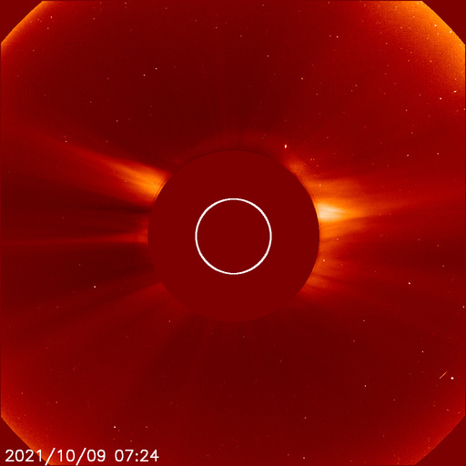</a> <a href="img/20211009-02.png">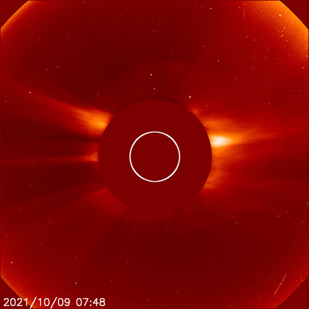</a> <a href="img/20211009-03.png">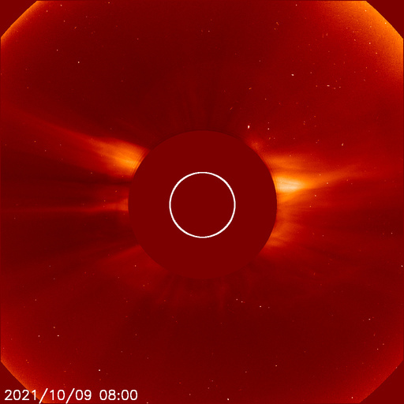</a> <a href="img/20211009-04.png">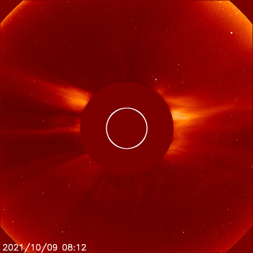</a> <a href="img/20211009-05.png">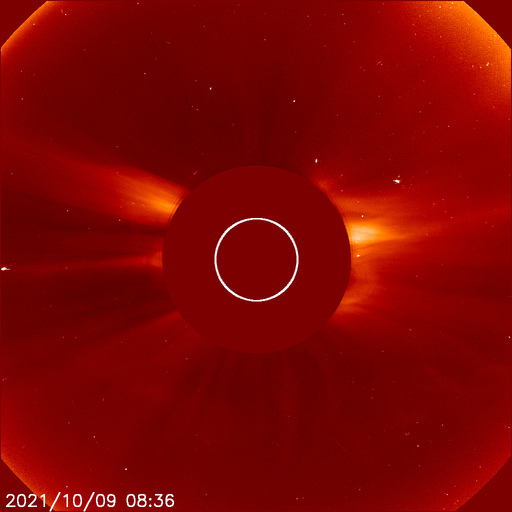</a> <a href="img/20211009-06.png">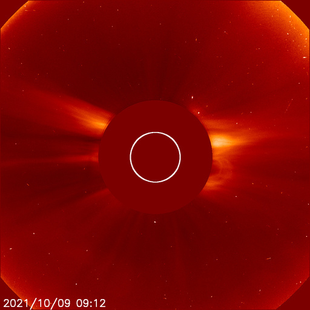</a> <a href="img/20211009-07.png">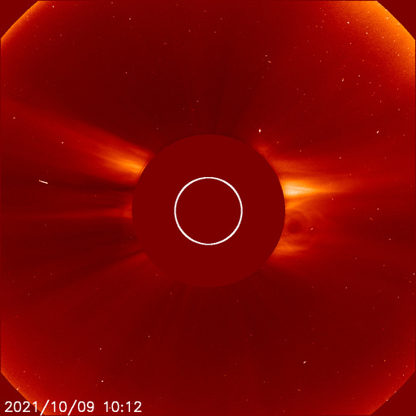</a> <a href="img/20211009-08.png">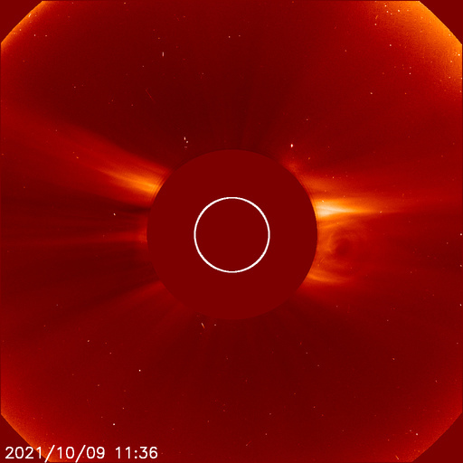</a> <a href="img/20211009-09.png">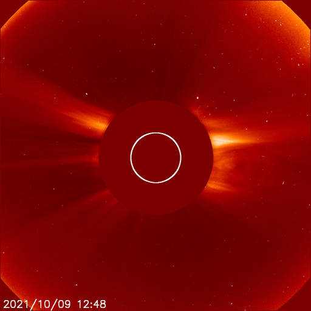</a> <a href="img/20211009-10.png">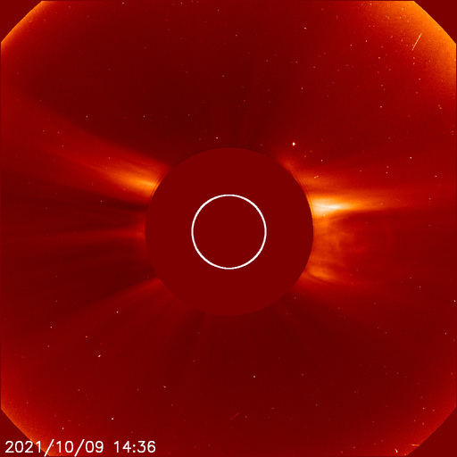</a> <a href="img/20211009-11.png">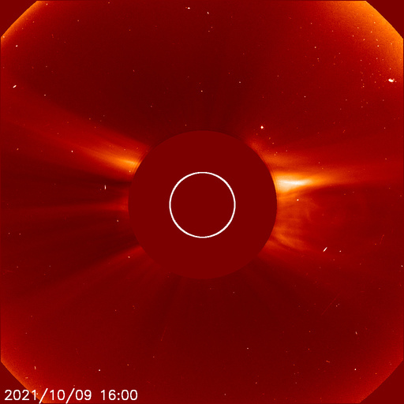</a> <a href="img/20211009-12.png">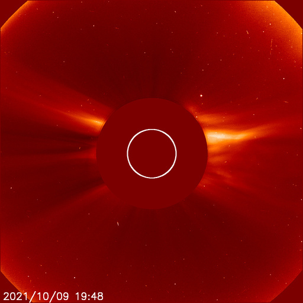</a>

### 2021-10-02

*CACTUS: <a href="https://wwwbis.sidc.be/cactus/catalog/LASCO/2_5_0/qkl/2021/10/CME0008/CME.html">CME0008</a> // SEEDS: <a href="http://spaceweather.gmu.edu/seeds/dailymkmovie.php?cme=20211002&r&cor2=a">COR2</a> & <a href="http://spaceweather.gmu.edu/seeds/dailymkmovie.php?cme=20211002&cor2=a">COR2A</a>*

<a href="img/20211002-01.png">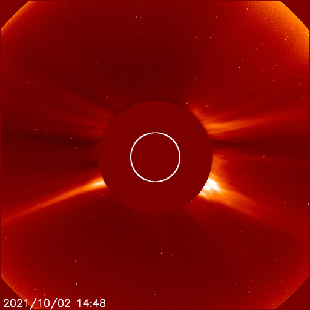</a> <a href="img/20211002-02.png">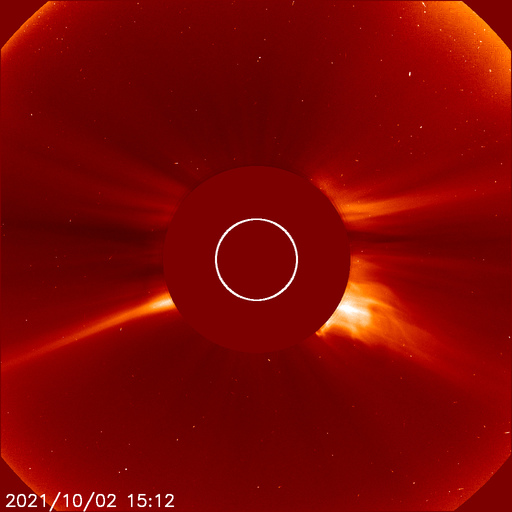</a> <a href="img/20211002-03.png">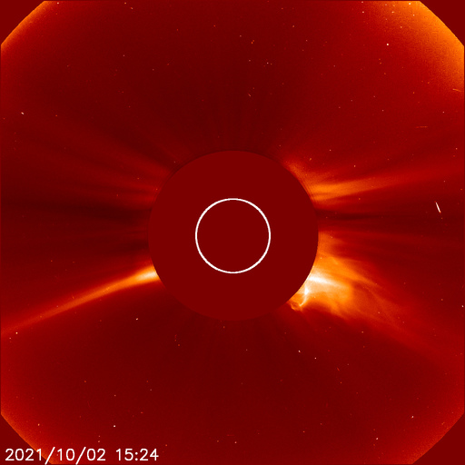</a> <a href="img/20211002-04.png">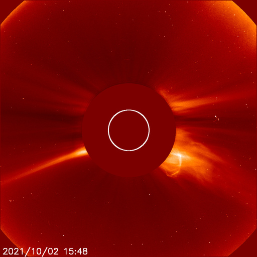</a> <a href="img/20211002-05.png">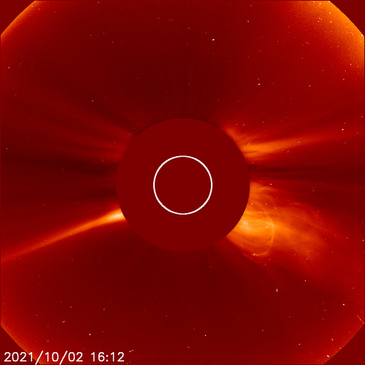</a> <a href="img/20211002-06.png">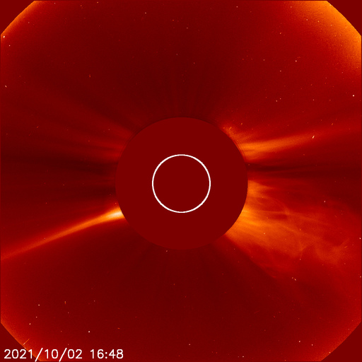</a> <a href="img/20211002-07.png">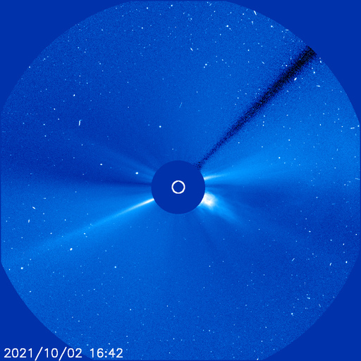</a> <a href="img/20211002-08.png">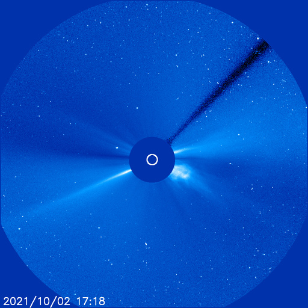</a>  <a href="img/20211002-10.png">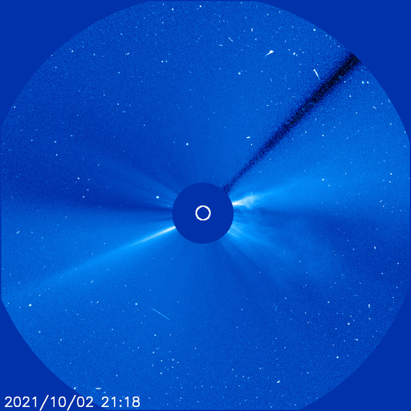</a>
