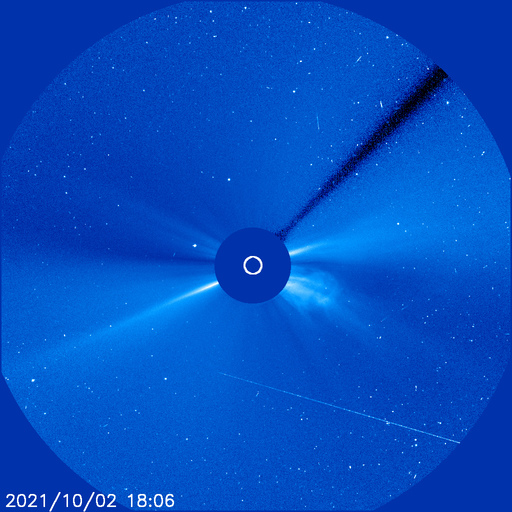

# Archive: October 2021

List of archived image observations from LASCO C2 and LASCO C3 published on Space Weather Prediction Center [website](https://www.swpc.noaa.gov/products/lasco-coronagraph) during the month October 2021.

#### 2021-10-09

           

#### 2021-10-02

         