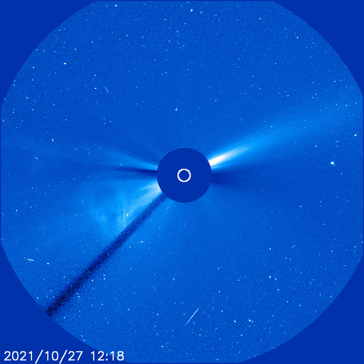
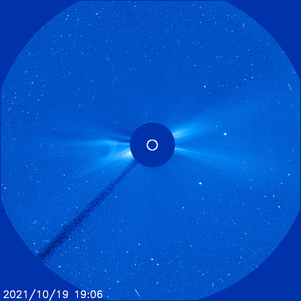
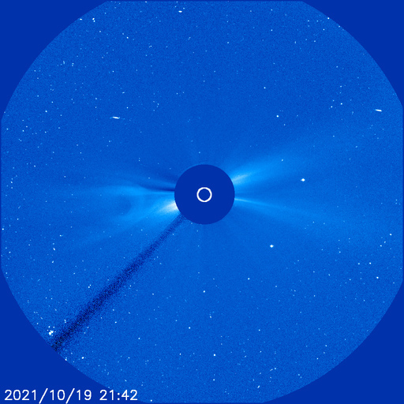
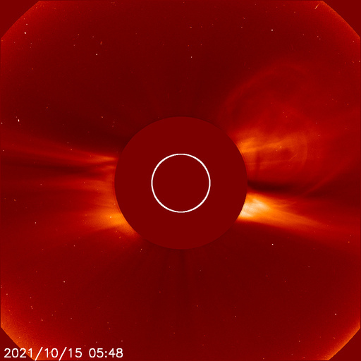

# Archive: October 2021

List of archived image observations from LASCO C2 and LASCO C3 published on Space Weather Prediction Center [website](https://www.swpc.noaa.gov/products/lasco-coronagraph) during the month October 2021.

### 2021-10-27

              

### 2021-10-23

    

### 2021-10-19

    

### 2021-10-17

### 2021-10-16

*CACTUS: <a href="https://wwwbis.sidc.be/cactus/catalog/LASCO/2_5_0/qkl/2021/10/CME0031/CME.html">CME0031</a> // SEEDS: <a href="http://spaceweather.gmu.edu/seeds/dailymkmovie.php?cme=20211016&r&cor2=a">COR2</a> & <a href="http://spaceweather.gmu.edu/seeds/dailymkmovie.php?cme=20211016&cor2=a">COR2A</a>*

                   

### 2021-10-15

*CACTUS: <a href="https://wwwbis.sidc.be/cactus/catalog/LASCO/2_5_0/qkl/2021/10/CME0027/CME.html">CME0027</a> // SEEDS: <a href="http://spaceweather.gmu.edu/seeds/dailymkmovie.php?cme=20211015&r&cor2=a">COR2</a> & <a href="http://spaceweather.gmu.edu/seeds/dailymkmovie.php?cme=20211015&cor2=a">COR2A</a>*

    

### 2021-10-13

*CACTUS: <a href="https://wwwbis.sidc.be/cactus/catalog/LASCO/2_5_0/qkl/2021/10/CME0024/CME.html">CME0024</a>, <a href="https://wwwbis.sidc.be/cactus/catalog/LASCO/2_5_0/qkl/2021/10/CME0025/CME.html">CME0025</a> // SEEDS: <a href="http://spaceweather.gmu.edu/seeds/dailymkmovie.php?cme=20211013&r&cor2=a">COR2</a> & <a href="http://spaceweather.gmu.edu/seeds/dailymkmovie.php?cme=20211013&cor2=a">COR2A</a>*

         

### 2021-10-10

*CACTUS: <a href="https://wwwbis.sidc.be/cactus/catalog/LASCO/2_5_0/qkl/2021/10/CME0014/CME.html">CME0014</a> // SEEDS: <a href="http://spaceweather.gmu.edu/seeds/dailymkmovie.php?cme=20211010&r&cor2=a">COR2</a> & <a href="http://spaceweather.gmu.edu/seeds/dailymkmovie.php?cme=20211010&cor2=a">COR2A</a>*

            

### 2021-10-09

Full halo CME that was associated with an M1/2B flare from Region 2882 (N17, L=157) on 09 October at 0638 UTC.

*CACTUS: <a href="https://wwwbis.sidc.be/cactus/catalog/LASCO/2_5_0/qkl/2021/10/CME0011/CME.html">CME0011</a>, <a href="https://wwwbis.sidc.be/cactus/catalog/LASCO/2_5_0/qkl/2021/10/CME0012/CME.html">CME0012</a>, <a href="https://wwwbis.sidc.be/cactus/catalog/LASCO/2_5_0/qkl/2021/10/CME0013/CME.html">CME0013</a> // SEEDS: <a href="http://spaceweather.gmu.edu/seeds/dailymkmovie.php?cme=20211009&r&cor2=a">COR2</a> & <a href="http://spaceweather.gmu.edu/seeds/dailymkmovie.php?cme=20211009&cor2=a">COR2A</a>*

           

### 2021-10-02

*CACTUS: <a href="https://wwwbis.sidc.be/cactus/catalog/LASCO/2_5_0/qkl/2021/10/CME0008/CME.html">CME0008</a> // SEEDS: <a href="http://spaceweather.gmu.edu/seeds/dailymkmovie.php?cme=20211002&r&cor2=a">COR2</a> & <a href="http://spaceweather.gmu.edu/seeds/dailymkmovie.php?cme=20211002&cor2=a">COR2A</a>*

         
