# Archive: September 2021

List of archived image observations from LASCO C2 and LASCO C3 published on Space Weather Prediction Center [website](https://www.swpc.noaa.gov/products/lasco-coronagraph) during the month September 2021.

### 2021-09-28

*CACTUS: <a href="https://www.sidc.be/cactus/catalog/LASCO/2_5_0/qkl/2021/09/CME0085/CME.html">CME0085</a> // SEEDS: <a href="http://spaceweather.gmu.edu/seeds/dailymkmovie.php?cme=20210928&r&cor2=a">COR2</a> & <a href="http://spaceweather.gmu.edu/seeds/dailymkmovie.php?cme=20210928&cor2=a">COR2A</a>*

 <a href="img/20210928-02.png">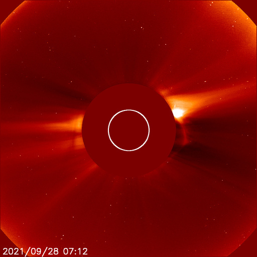</a>  <a href="img/20210928-04.png">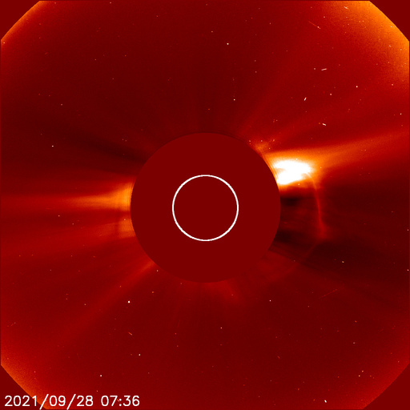</a>   <a href="img/20210928-07.png">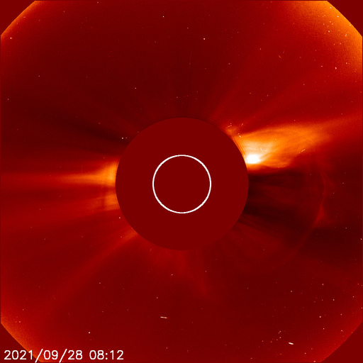</a> <a href="img/20210928-08.png">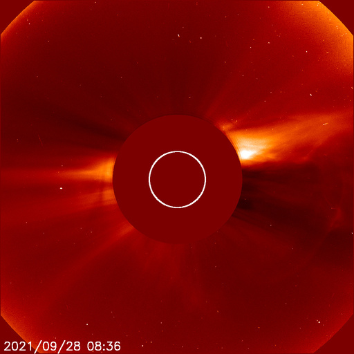</a>  

### 2021-09-23

<a href="img/20210923-01.png">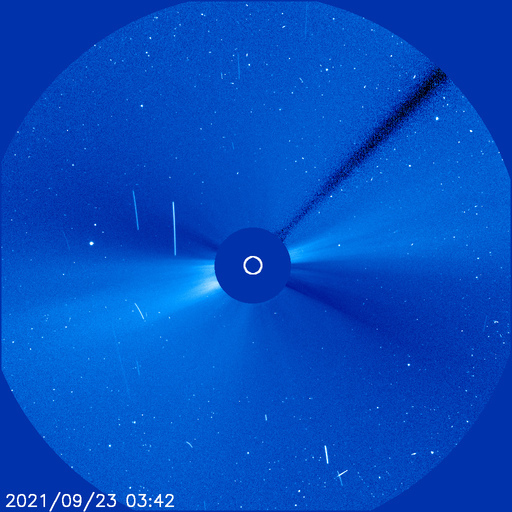</a>

### 2021-09-21

*CACTUS: <a href="https://www.sidc.be/cactus/catalog/LASCO/2_5_0/qkl/2021/09/CME0066/CME.html">CME0066</a> // SEEDS: <a href="http://spaceweather.gmu.edu/seeds/dailymkmovie.php?cme=20210921&r&cor2=a">COR2</a> & <a href="http://spaceweather.gmu.edu/seeds/dailymkmovie.php?cme=20210921&cor2=a">COR2A</a>*

<a href="img/20210921-01.png">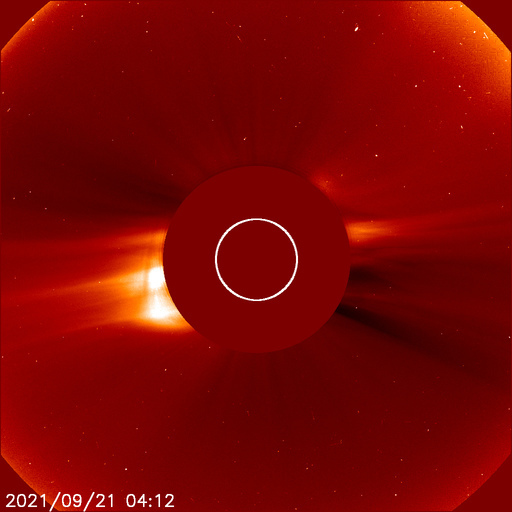</a> <a href="img/20210921-02.png">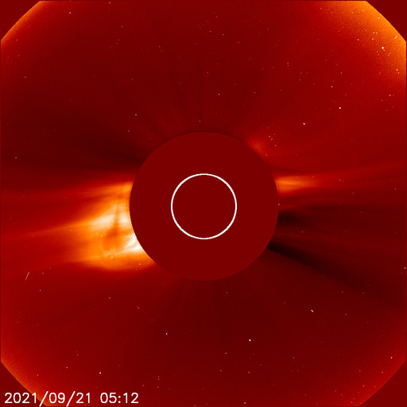</a>  <a href="img/20210921-04.png">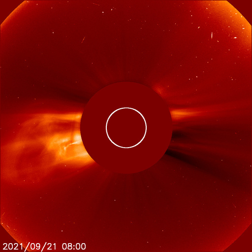</a> <a href="img/20210921-05.png">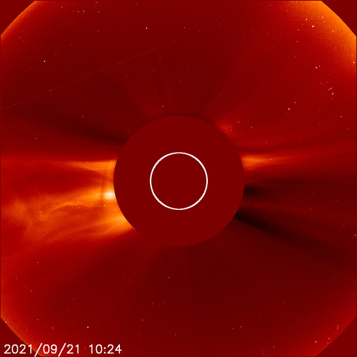</a>  <a href="img/20210921-07.png">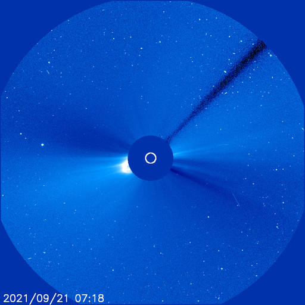</a>   

### 2021-09-18

*CACTUS: <a href="https://www.sidc.be/cactus/catalog/LASCO/2_5_0/qkl/2021/09/CME0055/CME.html">CME0055</a>, <a href="https://www.sidc.be/cactus/catalog/LASCO/2_5_0/qkl/2021/09/CME0057/CME.html">CME0057</a> // SEEDS: <a href="http://spaceweather.gmu.edu/seeds/dailymkmovie.php?cme=20210918&r&cor2=a">COR2</a> & <a href="http://spaceweather.gmu.edu/seeds/dailymkmovie.php?cme=20210918&cor2=a">COR2A</a>*

<a href="img/20210918-01.png">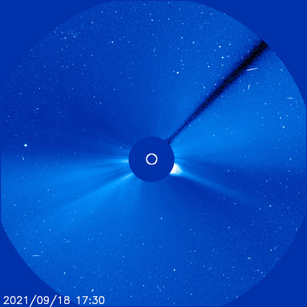</a> <a href="img/20210918-02.png">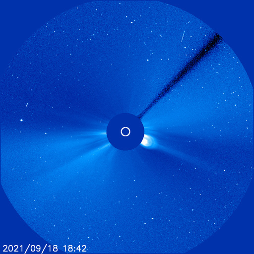</a> <a href="img/20210918-03.png">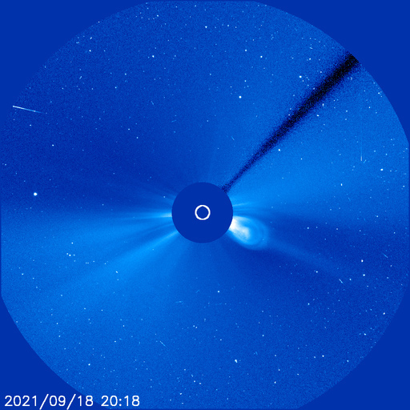</a>     <a href="img/20210918-08.png">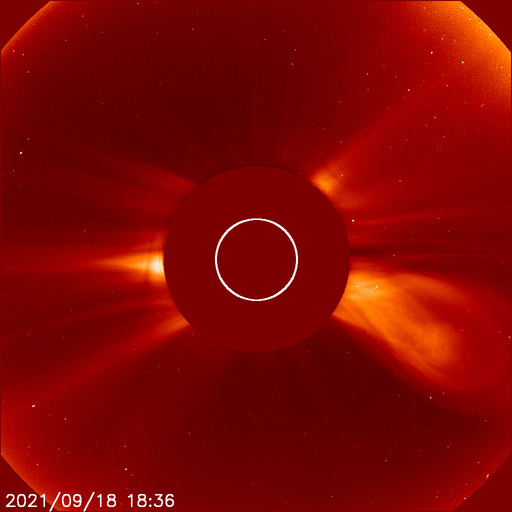</a> <a href="img/20210918-09.png">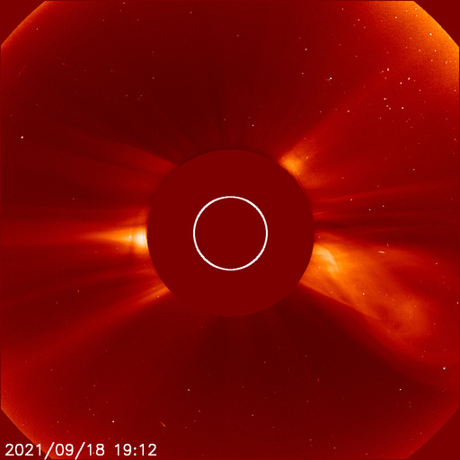</a> 

### 2021-09-17

*CACTUS: <a href="https://www.sidc.be/cactus/catalog/LASCO/2_5_0/qkl/2021/09/CME0045/CME.html">CME0045</a> // SEEDS: <a href="http://spaceweather.gmu.edu/seeds/dailymkmovie.php?cme=20210917&r&cor2=a">COR2</a> & <a href="http://spaceweather.gmu.edu/seeds/dailymkmovie.php?cme=20210917&cor2=a">COR2A</a>*

<a href="img/20210917-01.png">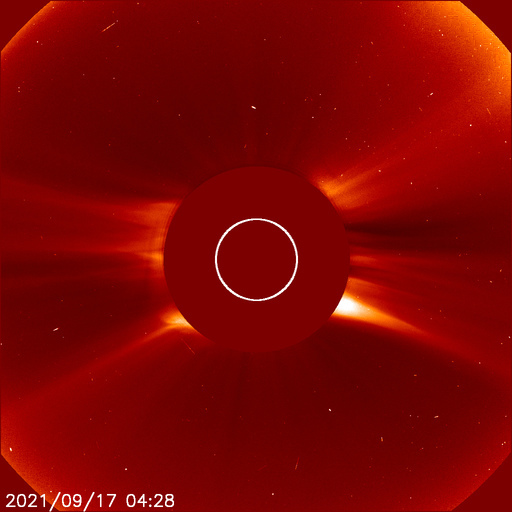</a> <a href="img/20210917-02.png">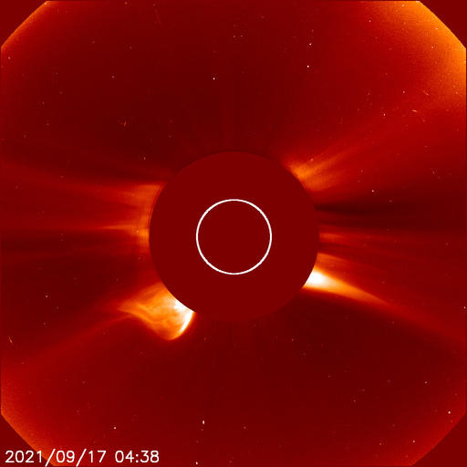</a>   <a href="img/20210917-05.png">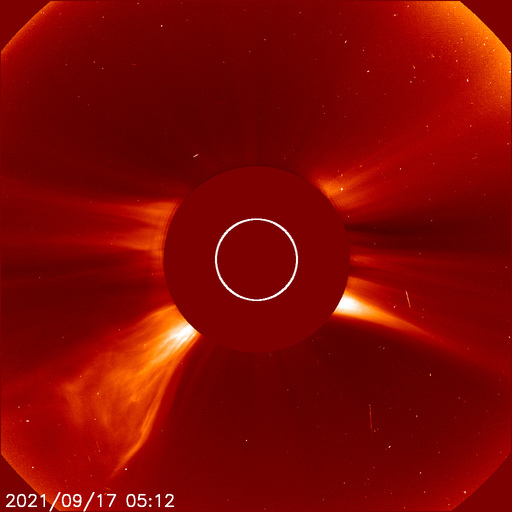</a>   

### 2021-09-15

*CACTUS: <a href="https://www.sidc.be/cactus/catalog/LASCO/2_5_0/qkl/2021/09/CME0040/CME.html">CME0040</a> // SEEDS: <a href="http://spaceweather.gmu.edu/seeds/dailymkmovie.php?cme=20210915&r&cor2=a">COR2</a> & <a href="http://spaceweather.gmu.edu/seeds/dailymkmovie.php?cme=20210915&cor2=a">COR2A</a>*

  <a href="img/20210915-03.png">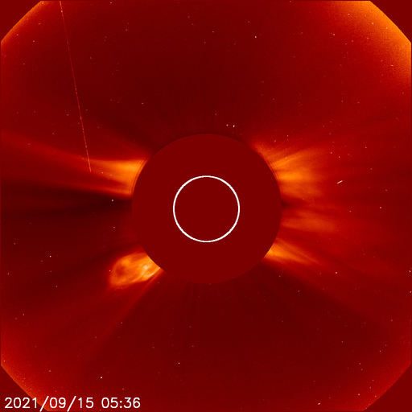</a>   <a href="img/20210915-06.png">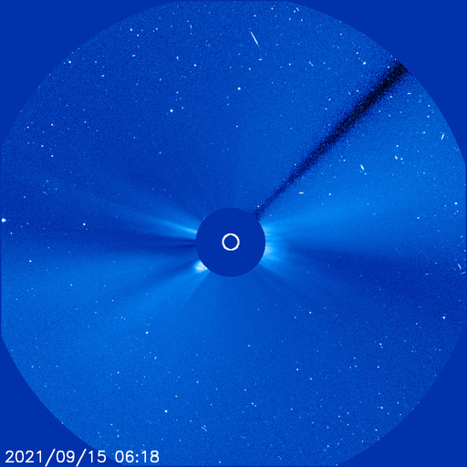</a>  <a href="img/20210915-08.png">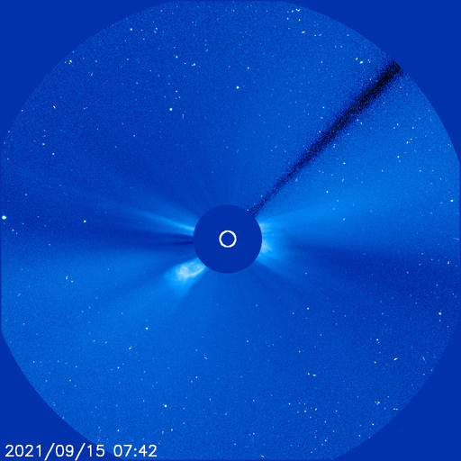</a> <a href="img/20210915-09.png">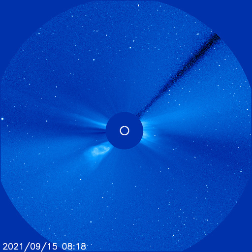</a> <a href="img/20210915-10.png">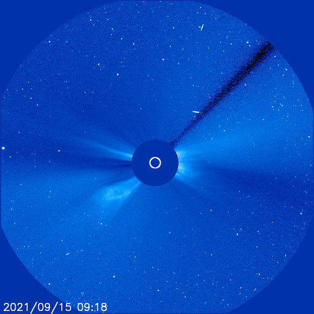</a>

### 2021-09-14

*CACTUS: <a href="https://www.sidc.be/cactus/catalog/LASCO/2_5_0/qkl/2021/09/CME0037/CME.html">CME0037</a> // SEEDS: <a href="http://spaceweather.gmu.edu/seeds/dailymkmovie.php?cme=20210914&r&cor2=a">COR2</a> & <a href="http://spaceweather.gmu.edu/seeds/dailymkmovie.php?cme=20210914&cor2=a">COR2A</a>*

<a href="img/20210914-01.png">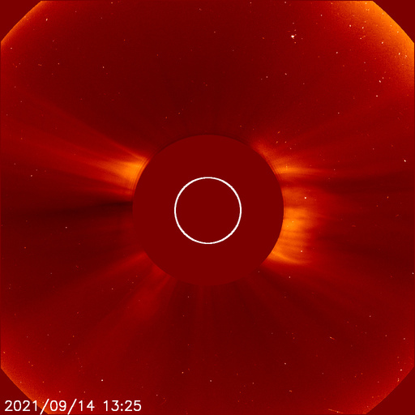</a> <a href="img/20210914-02.png">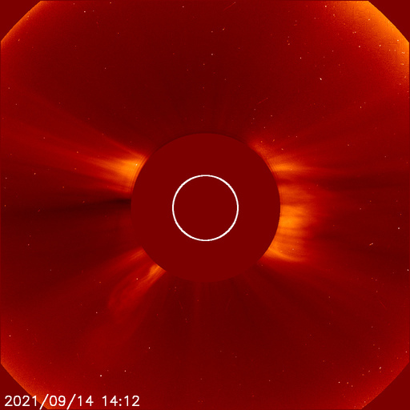</a>   <a href="img/20210914-05.png">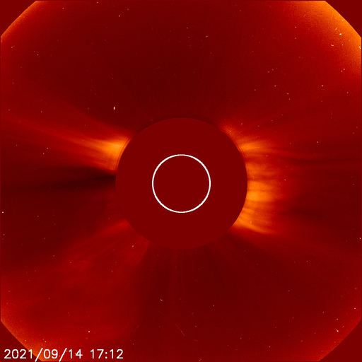</a>

### 2021-09-13

*CACTUS: <a href="https://www.sidc.be/cactus/catalog/LASCO/2_5_0/qkl/2021/09/CME0026/CME.html">CME0026</a> // SEEDS: <a href="http://spaceweather.gmu.edu/seeds/dailymkmovie.php?cme=20210913&r&cor2=a">COR2</a> & <a href="http://spaceweather.gmu.edu/seeds/dailymkmovie.php?cme=20210913&cor2=a">COR2A</a>*

  <a href="img/20210913-03.png">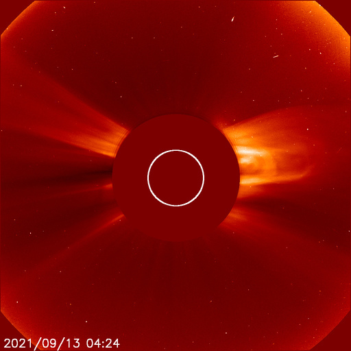</a>  

### 2021-09-12

*CACTUS: <a href="https://www.sidc.be/cactus/catalog/LASCO/2_5_0/qkl/2021/09/CME0022/CME.html">CME0022</a>, <a href="https://www.sidc.be/cactus/catalog/LASCO/2_5_0/qkl/2021/09/CME0023/CME.html">CME0023</a> // SEEDS: <a href="http://spaceweather.gmu.edu/seeds/dailymkmovie.php?cme=20210912&r&cor2=a">COR2</a> & <a href="http://spaceweather.gmu.edu/seeds/dailymkmovie.php?cme=20210912&cor2=a">COR2A</a>*

<a href="img/20210912-01.png">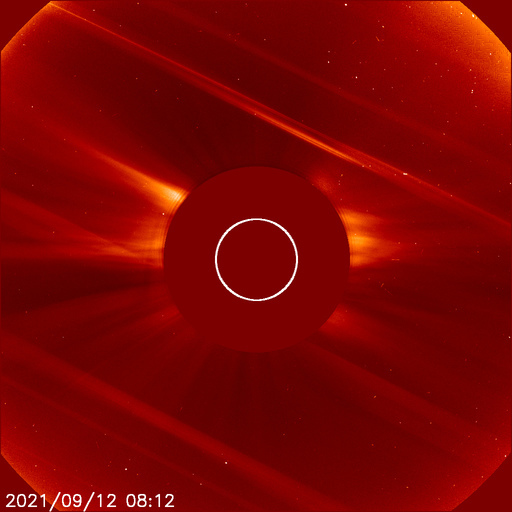</a>    <a href="img/20210912-05.png">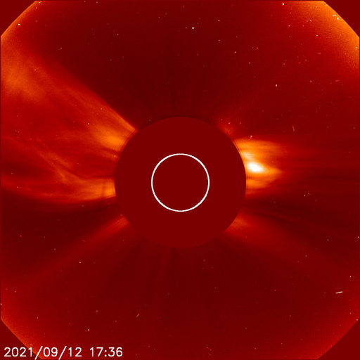</a>  <a href="img/20210912-07.png">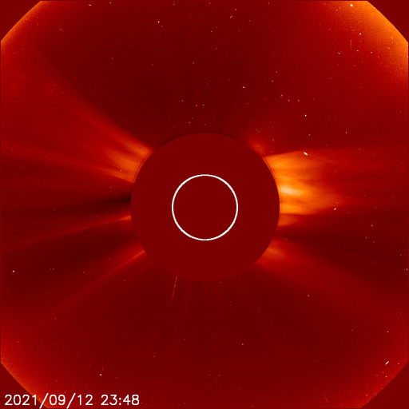</a> <a href="img/20210912-08.png">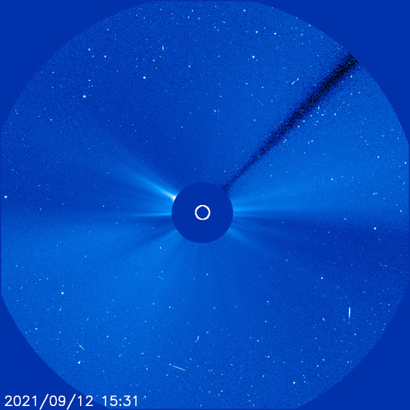</a>  <a href="img/20210912-10.png">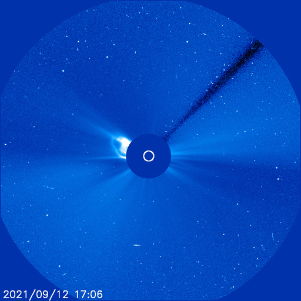</a>  <a href="img/20210912-12.png">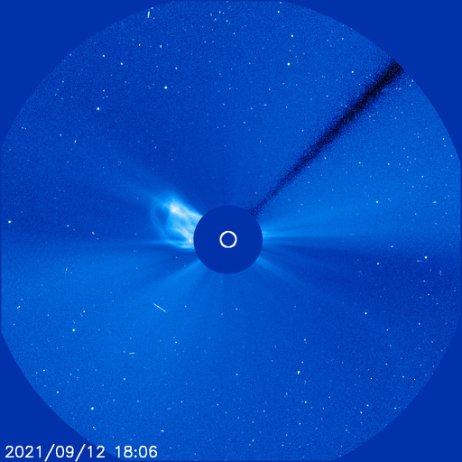</a> <a href="img/20210912-13.png">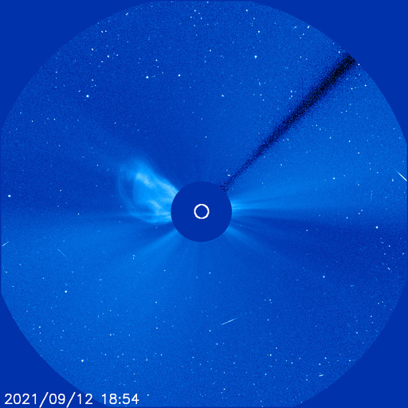</a> <a href="img/20210912-14.png">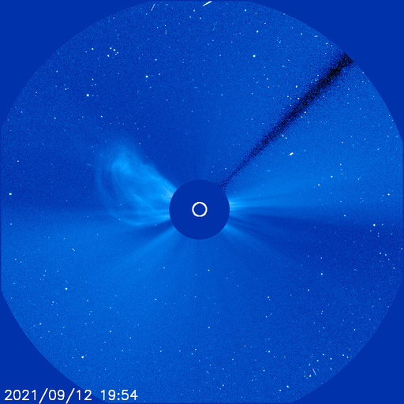</a> 

### 2021-09-11

*CACTUS: <a href="https://www.sidc.be/cactus/catalog/LASCO/2_5_0/qkl/2021/09/CME0018/CME.html">CME0018</a>, <a href="https://www.sidc.be/cactus/catalog/LASCO/2_5_0/qkl/2021/09/CME0021/CME.html">CME0021</a> // SEEDS: <a href="http://spaceweather.gmu.edu/seeds/dailymkmovie.php?cme=20210911&r&cor2=a">COR2</a> & <a href="http://spaceweather.gmu.edu/seeds/dailymkmovie.php?cme=20210911&cor2=a">COR2A</a>*

    

### 2021-09-06

*CACTUS: <a href="https://www.sidc.be/cactus/catalog/LASCO/2_5_0/qkl/2021/09/CME0005/CME.html">CME0005</a> // SEEDS: <a href="http://spaceweather.gmu.edu/seeds/dailymkmovie.php?cme=20210906&r&cor2=a">COR2</a> & <a href="http://spaceweather.gmu.edu/seeds/dailymkmovie.php?cme=20210906&cor2=a">COR2A</a>*

  <a href="img/20210906-03.png">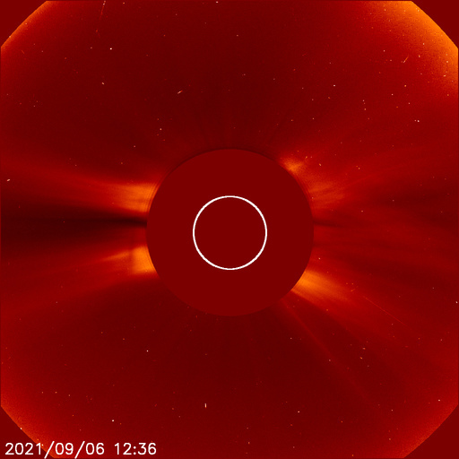</a> <a href="img/20210906-04.png">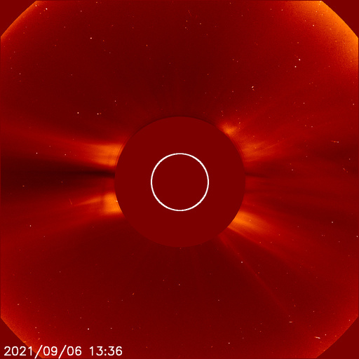</a> <a href="img/20210906-05.png">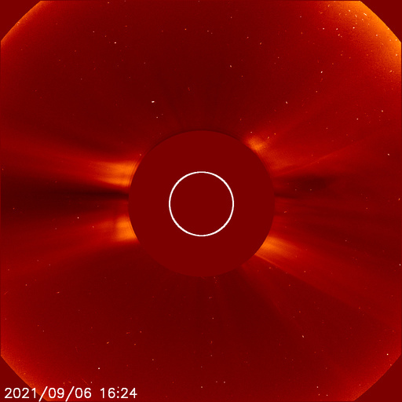</a>
