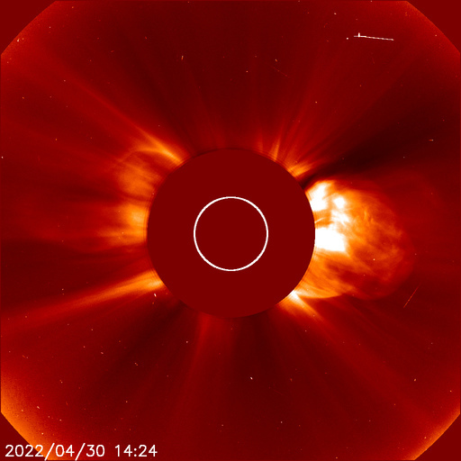
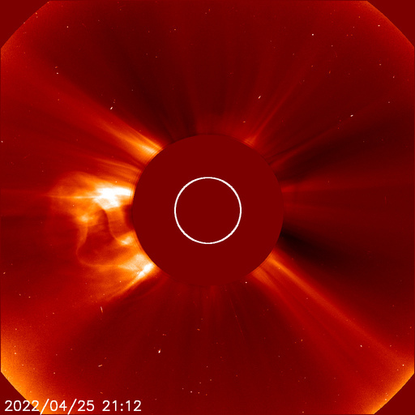
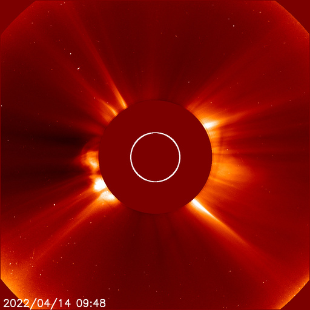
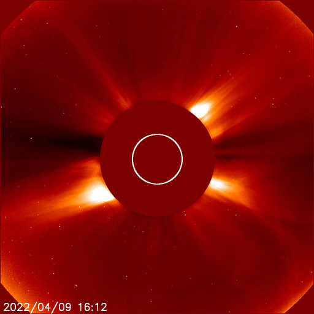
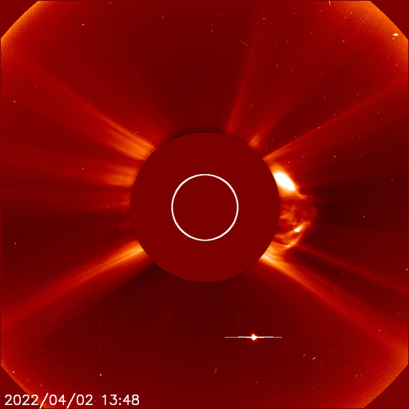

# Archive: April 2022

List of archived image observations from LASCO C2 and LASCO C3 published on Space Weather Prediction Center [website](https://www.swpc.noaa.gov/products/lasco-coronagraph) during the month April 2022.

### 2022-04-30

Region 2994 (N15, L=107) produced an impulsive X1 flare at 1347 UTC on 30 April 2022.

*CACTUS: <a href="https://www.sidc.be/cactus/catalog/LASCO/2_5_0/qkl/2022/04/CME0148/CME.html">CME0148</a>, <a href="https://www.sidc.be/cactus/catalog/LASCO/2_5_0/qkl/2022/04/CME0151/CME.html">CME0151</a>, <a href="https://www.sidc.be/cactus/catalog/LASCO/2_5_0/qkl/2022/04/CME0152/CME.html">CME0152</a> // SEEDS: <a href="http://spaceweather.gmu.edu/seeds/dailymkmovie.php?cme=20220430&r&cor2=a">COR2</a> & <a href="http://spaceweather.gmu.edu/seeds/dailymkmovie.php?cme=20220430&cor2=a">COR2A</a>*

                 

### 2022-04-28

*CACTUS: <a href="https://www.sidc.be/cactus/catalog/LASCO/2_5_0/qkl/2022/04/CME0144/CME.html">CME0144</a> // SEEDS: <a href="http://spaceweather.gmu.edu/seeds/dailymkmovie.php?cme=20220428&r&cor2=a">COR2</a> & <a href="http://spaceweather.gmu.edu/seeds/dailymkmovie.php?cme=20220428&cor2=a">COR2A</a>*

     

### 2022-04-27

*CACTUS: <a href="https://www.sidc.be/cactus/catalog/LASCO/2_5_0/qkl/2022/04/CME0130/CME.html">CME0130</a> // SEEDS: <a href="http://spaceweather.gmu.edu/seeds/dailymkmovie.php?cme=20220427&r&cor2=a">COR2</a> & <a href="http://spaceweather.gmu.edu/seeds/dailymkmovie.php?cme=20220427&cor2=a">COR2A</a>*

             

### 2022-04-25

*CACTUS: <a href="https://www.sidc.be/cactus/catalog/LASCO/2_5_0/qkl/2022/04/CME0121/CME.html">CME0121</a> // SEEDS: <a href="http://spaceweather.gmu.edu/seeds/dailymkmovie.php?cme=20220425&r&cor2=a">COR2</a> & <a href="http://spaceweather.gmu.edu/seeds/dailymkmovie.php?cme=20220425&cor2=a">COR2A</a>*

               

### 2022-04-24

*CACTUS: <a href="https://www.sidc.be/cactus/catalog/LASCO/2_5_0/qkl/2022/04/CME0111/CME.html">CME0111</a> // SEEDS: <a href="http://spaceweather.gmu.edu/seeds/dailymkmovie.php?cme=20220424&r&cor2=a">COR2</a> & <a href="http://spaceweather.gmu.edu/seeds/dailymkmovie.php?cme=20220424&cor2=a">COR2A</a>*

    

### 2022-04-20

*CACTUS: <a href="https://www.sidc.be/cactus/catalog/LASCO/2_5_0/qkl/2022/04/CME0092/CME.html">CME0092</a> // SEEDS: <a href="http://spaceweather.gmu.edu/seeds/dailymkmovie.php?cme=20220420&r&cor2=a">COR2</a> & <a href="http://spaceweather.gmu.edu/seeds/dailymkmovie.php?cme=20220420&cor2=a">COR2A</a>*

          

### 2022-04-19

An X2.2 flare (R3-Strong Radio Blackout) occurred at 11:57pm EDT on 19 April, 2022 (20/0357 UTC). The flare erupted from a region just beyond the southwest limb of the Sun – likely former Region 2992.

*CACTUS: <a href="https://www.sidc.be/cactus/catalog/LASCO/2_5_0/qkl/2022/04/CME0089/CME.html">CME0089</a> // SEEDS: <a href="http://spaceweather.gmu.edu/seeds/dailymkmovie.php?cme=20220419&r&cor2=a">COR2</a> & <a href="http://spaceweather.gmu.edu/seeds/dailymkmovie.php?cme=20220419&cor2=a">COR2A</a>*

    

### 2022-04-17

An X1 flare was observed at 17/0334 UTC from newly numbered Region 2994 (N14E75). This R3 (Strong) event had an associated Type II radio sweep and 10 cm radio burst. A coronal mass ejection was observed in SOHO/LASCO C2 imagery starting at 17/0348 UTC. Region 2994 and Region 2993 (N22E61) form a cluster of active sunspots that have produced significant flaring prior to appearing on the eastern limb.

*CACTUS: <a href="https://www.sidc.be/cactus/catalog/LASCO/2_5_0/qkl/2022/04/CME0078/CME.html">CME0078</a>, <a href="https://www.sidc.be/cactus/catalog/LASCO/2_5_0/qkl/2022/04/CME0079/CME.html">CME0079</a>, <a href="https://www.sidc.be/cactus/catalog/LASCO/2_5_0/qkl/2022/04/CME0081/CME.html">CME0081</a> // SEEDS: <a href="http://spaceweather.gmu.edu/seeds/dailymkmovie.php?cme=20220417&r&cor2=a">COR2</a> & <a href="http://spaceweather.gmu.edu/seeds/dailymkmovie.php?cme=20220417&cor2=a">COR2A</a>*

                               

### 2022-04-16

*CACTUS: <a href="https://www.sidc.be/cactus/catalog/LASCO/2_5_0/qkl/2022/04/CME0072/CME.html">CME0072</a> // SEEDS: <a href="http://spaceweather.gmu.edu/seeds/dailymkmovie.php?cme=20220416&r&cor2=a">COR2</a> & <a href="http://spaceweather.gmu.edu/seeds/dailymkmovie.php?cme=20220416&cor2=a">COR2A</a>*

         

### 2022-04-15

*CACTUS: <a href="https://www.sidc.be/cactus/catalog/LASCO/2_5_0/qkl/2022/04/CME0066/CME.html">CME0066</a>, <a href="https://www.sidc.be/cactus/catalog/LASCO/2_5_0/qkl/2022/04/CME0067/CME.html">CME0067</a> // SEEDS: <a href="http://spaceweather.gmu.edu/seeds/dailymkmovie.php?cme=20220415&r&cor2=a">COR2</a> & <a href="http://spaceweather.gmu.edu/seeds/dailymkmovie.php?cme=20220415&cor2=a">COR2A</a>*

      

### 2022-04-14

*CACTUS: <a href="https://www.sidc.be/cactus/catalog/LASCO/2_5_0/qkl/2022/04/CME0064/CME.html">CME0064</a> // SEEDS: <a href="http://spaceweather.gmu.edu/seeds/dailymkmovie.php?cme=20220414&r&cor2=a">COR2</a> & <a href="http://spaceweather.gmu.edu/seeds/dailymkmovie.php?cme=20220414&cor2=a">COR2A</a>*

    

### 2022-04-11

A G2 (Moderate) geomagnetic storm began at 12:45 pm EDT (1645 UTC) on 14 April, 2022. G1 (Minor) storm levels first occurred earlier, at 7:59 am EDT (1159 UTC). This activity is associated with the anticipated arrival of an 11 April coronal mass ejection (CME). The CME arrived at the NOAA DSCOVR spacecraft, about 1 million miles from Earth, early on 14 April. While an interplanetary shock ahead of the CME was not clearly observed, total interplanetary magnetic field (IMF) strength gradually intensified to 20 nT and the Bz component (magnetic field orientation) turned into a prolonged, pronounced southward direction.

*CACTUS: <a href="https://www.sidc.be/cactus/catalog/LASCO/2_5_0/qkl/2022/04/CME0055/CME.html">CME0055</a> // SEEDS: <a href="http://spaceweather.gmu.edu/seeds/dailymkmovie.php?cme=20220411&r&cor2=a">COR2</a> & <a href="http://spaceweather.gmu.edu/seeds/dailymkmovie.php?cme=20220411&cor2=a">COR2A</a>*

    

### 2022-04-09

*CACTUS: <a href="https://www.sidc.be/cactus/catalog/LASCO/2_5_0/qkl/2022/04/CME0042/CME.html">CME0042</a> // SEEDS: <a href="http://spaceweather.gmu.edu/seeds/dailymkmovie.php?cme=20220409&r&cor2=a">COR2</a> & <a href="http://spaceweather.gmu.edu/seeds/dailymkmovie.php?cme=20220409&cor2=a">COR2A</a>*

                

### 2022-04-07

*CACTUS: <a href="https://www.sidc.be/cactus/catalog/LASCO/2_5_0/qkl/2022/04/CME0038/CME.html">CME0038</a> // SEEDS: <a href="http://spaceweather.gmu.edu/seeds/dailymkmovie.php?cme=20220407&r&cor2=a">COR2</a> & <a href="http://spaceweather.gmu.edu/seeds/dailymkmovie.php?cme=20220407&cor2=a">COR2A</a>*

    

### 2022-04-06

*CACTUS: <a href="https://www.sidc.be/cactus/catalog/LASCO/2_5_0/qkl/2022/04/CME0036/CME.html">CME0036</a> // SEEDS: <a href="http://spaceweather.gmu.edu/seeds/dailymkmovie.php?cme=20220406&r&cor2=a">COR2</a> & <a href="http://spaceweather.gmu.edu/seeds/dailymkmovie.php?cme=20220406&cor2=a">COR2A</a>*

         

### 2022-04-04

*CACTUS: <a href="https://www.sidc.be/cactus/catalog/LASCO/2_5_0/qkl/2022/04/CME0017/CME.html">CME0017</a>, <a href="https://www.sidc.be/cactus/catalog/LASCO/2_5_0/qkl/2022/04/CME0018/CME.html">CME0018</a> // SEEDS: <a href="http://spaceweather.gmu.edu/seeds/dailymkmovie.php?cme=20220404&r&cor2=a">COR2</a> & <a href="http://spaceweather.gmu.edu/seeds/dailymkmovie.php?cme=20220404&cor2=a">COR2A</a>*

          

### 2022-04-02

*CACTUS: <a href="https://www.sidc.be/cactus/catalog/LASCO/2_5_0/qkl/2022/04/CME0006/CME.html">CME0006</a> // SEEDS: <a href="http://spaceweather.gmu.edu/seeds/dailymkmovie.php?cme=20220402&r&cor2=a">COR2</a> & <a href="http://spaceweather.gmu.edu/seeds/dailymkmovie.php?cme=20220402&cor2=a">COR2A</a>*

           

### 2022-04-01

*CACTUS: <a href="https://www.sidc.be/cactus/catalog/LASCO/2_5_0/qkl/2022/04/CME0003/CME.html">CME0003</a> // SEEDS: <a href="http://spaceweather.gmu.edu/seeds/dailymkmovie.php?cme=20220401&r&cor2=a">COR2</a> & <a href="http://spaceweather.gmu.edu/seeds/dailymkmovie.php?cme=20220401&cor2=a">COR2A</a>*

              
