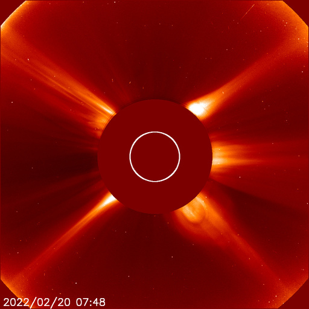
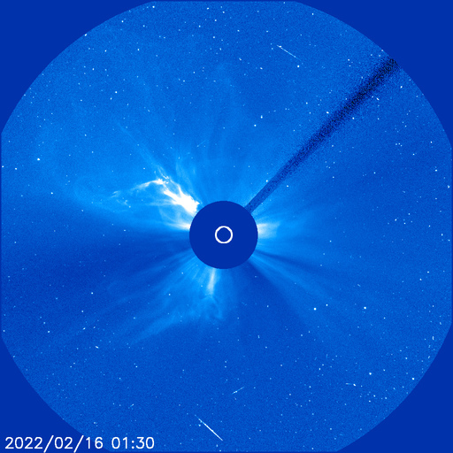
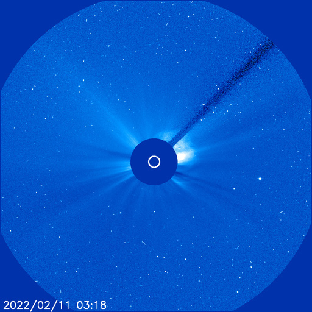

# Archive: February 2022

List of archived image observations from LASCO C2 and LASCO C3 published on Space Weather Prediction Center [website](https://www.swpc.noaa.gov/products/lasco-coronagraph) during the month February 2022.

### 2022-02-28

*CACTUS: <a href="https://www.sidc.be/cactus/catalog/LASCO/2_5_0/qkl/2022/02/CME0092/CME.html">CME0092</a> // SEEDS: <a href="http://spaceweather.gmu.edu/seeds/dailymkmovie.php?cme=20220228&r&cor2=a">COR2</a> & <a href="http://spaceweather.gmu.edu/seeds/dailymkmovie.php?cme=20220228&cor2=a">COR2A</a>*

         

### 2022-02-26

### 2022-02-20

*CACTUS: <a href="https://www.sidc.be/cactus/catalog/LASCO/2_5_0/qkl/2022/02/CME0078/CME.html">CME0078</a>, <a href="https://www.sidc.be/cactus/catalog/LASCO/2_5_0/qkl/2022/02/CME0080/CME.html">CME0080</a> // SEEDS: <a href="http://spaceweather.gmu.edu/seeds/dailymkmovie.php?cme=20220220&r&cor2=a">COR2</a> & <a href="http://spaceweather.gmu.edu/seeds/dailymkmovie.php?cme=20220220&cor2=a">COR2A</a>*

          

### 2022-02-19

*CACTUS: <a href="https://www.sidc.be/cactus/catalog/LASCO/2_5_0/qkl/2022/02/CME0077/CME.html">CME0077</a> // SEEDS: <a href="http://spaceweather.gmu.edu/seeds/dailymkmovie.php?cme=20220219&r&cor2=a">COR2</a> & <a href="http://spaceweather.gmu.edu/seeds/dailymkmovie.php?cme=20220219&cor2=a">COR2A</a>*

         

### 2022-02-15

*CACTUS: <a href="https://www.sidc.be/cactus/catalog/LASCO/2_5_0/qkl/2022/02/CME0061/CME.html">CME0061</a> // SEEDS: <a href="http://spaceweather.gmu.edu/seeds/dailymkmovie.php?cme=20220215&r&cor2=a">COR2</a> & <a href="http://spaceweather.gmu.edu/seeds/dailymkmovie.php?cme=20220215&cor2=a">COR2A</a>*

                 

### 2022-02-13

*CACTUS: <a href="https://www.sidc.be/cactus/catalog/LASCO/2_5_0/qkl/2022/02/CME0052/CME.html">CME0052</a> // SEEDS: <a href="http://spaceweather.gmu.edu/seeds/dailymkmovie.php?cme=20220213&r&cor2=a">COR2</a> & <a href="http://spaceweather.gmu.edu/seeds/dailymkmovie.php?cme=20220213&cor2=a">COR2A</a>*

         

### 2022-02-12

*CACTUS: <a href="https://www.sidc.be/cactus/catalog/LASCO/2_5_0/qkl/2022/02/CME0045/CME.html">CME0045</a>, <a href="https://www.sidc.be/cactus/catalog/LASCO/2_5_0/qkl/2022/02/CME0046/CME.html">CME0046</a>, <a href="https://www.sidc.be/cactus/catalog/LASCO/2_5_0/qkl/2022/02/CME0049/CME.html">CME0049</a> // SEEDS: <a href="http://spaceweather.gmu.edu/seeds/dailymkmovie.php?cme=20220212&r&cor2=a">COR2</a> & <a href="http://spaceweather.gmu.edu/seeds/dailymkmovie.php?cme=20220212&cor2=a">COR2A</a>*

                  

### 2022-02-11

*CACTUS: <a href="https://www.sidc.be/cactus/catalog/LASCO/2_5_0/qkl/2022/02/CME0039/CME.html">CME0039</a>, <a href="https://www.sidc.be/cactus/catalog/LASCO/2_5_0/qkl/2022/02/CME0040/CME.html">CME0040</a> // SEEDS: <a href="http://spaceweather.gmu.edu/seeds/dailymkmovie.php?cme=20220211&r&cor2=a">COR2</a> & <a href="http://spaceweather.gmu.edu/seeds/dailymkmovie.php?cme=20220211&cor2=a">COR2A</a>*

    

### 2022-02-08

*CACTUS: <a href="https://www.sidc.be/cactus/catalog/LASCO/2_5_0/qkl/2022/02/CME0035/CME.html">CME0035</a> // SEEDS: <a href="http://spaceweather.gmu.edu/seeds/dailymkmovie.php?cme=20220208&r&cor2=a">COR2</a> & <a href="http://spaceweather.gmu.edu/seeds/dailymkmovie.php?cme=20220208&cor2=a">COR2A</a>*

    

### 2022-02-03

*CACTUS: <a href="https://www.sidc.be/cactus/catalog/LASCO/2_5_0/qkl/2022/02/CME0012/CME.html">CME0012</a> // SEEDS: <a href="http://spaceweather.gmu.edu/seeds/dailymkmovie.php?cme=20220203&r&cor2=a">COR2</a> & <a href="http://spaceweather.gmu.edu/seeds/dailymkmovie.php?cme=20220203&cor2=a">COR2A</a>*

    
