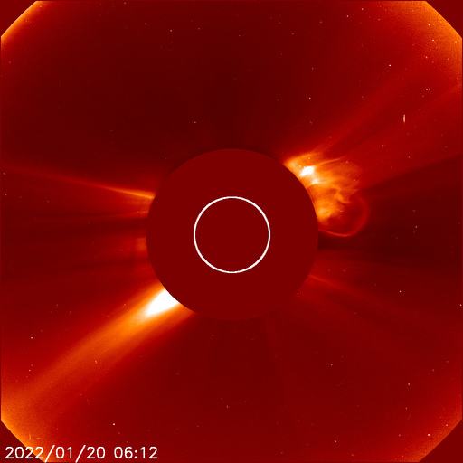

# Archive: January 2022

List of archived image observations from LASCO C2 and LASCO C3 published on Space Weather Prediction Center [website](https://www.swpc.noaa.gov/products/lasco-coronagraph) during the month January 2022.

### 2022-01-29

NOAA/SWPC Region 2936 produced an M1 flare (R1-Minor Radio Blackout) on 29 January at 6:32 pm ET (29/2332 UTC). This flare was associated with an asymmetric, full halo coronal mass ejection (CME) as observed in NASA/SOHO LASCO coronagraph imagery. Multiple analyses by SWPC forecasters indicated an approximate CME speed of 662 km/s and an at Earth arrival window as early as late 1 Feb to early 2 Feb ET.

*CACTUS: <a href="https://www.sidc.be/cactus/catalog/LASCO/2_5_0/qkl/2022/01/CME0084/CME.html">CME0084</a> // SEEDS: <a href="http://spaceweather.gmu.edu/seeds/dailymkmovie.php?cme=20220129&r&cor2=a">COR2</a> & <a href="http://spaceweather.gmu.edu/seeds/dailymkmovie.php?cme=20220129&cor2=a">COR2A</a>*

         

### 2022-01-21

*CACTUS: <a href="https://www.sidc.be/cactus/catalog/LASCO/2_5_0/qkl/2022/01/CME0061/CME.html">CME0061</a> // SEEDS: <a href="http://spaceweather.gmu.edu/seeds/dailymkmovie.php?cme=20220121&r&cor2=a">COR2</a> & <a href="http://spaceweather.gmu.edu/seeds/dailymkmovie.php?cme=20220121&cor2=a">COR2A</a>*

     

### 2022-01-20

*CACTUS: <a href="https://www.sidc.be/cactus/catalog/LASCO/2_5_0/qkl/2022/01/CME0057/CME.html">CME0057</a> // SEEDS: <a href="http://spaceweather.gmu.edu/seeds/dailymkmovie.php?cme=20220120&r&cor2=a">COR2</a> & <a href="http://spaceweather.gmu.edu/seeds/dailymkmovie.php?cme=20220120&cor2=a">COR2A</a>*

               

### 2022-01-15

*CACTUS: <a href="https://www.sidc.be/cactus/catalog/LASCO/2_5_0/qkl/2022/01/CME0045/CME.html">CME0045</a> // SEEDS: <a href="http://spaceweather.gmu.edu/seeds/dailymkmovie.php?cme=20220115&r&cor2=a">COR2</a> & <a href="http://spaceweather.gmu.edu/seeds/dailymkmovie.php?cme=20220115&cor2=a">COR2A</a>*

      

### 2022-01-14

*CACTUS: <a href="https://www.sidc.be/cactus/catalog/LASCO/2_5_0/qkl/2022/01/CME0038/CME.html">CME0038</a> // SEEDS: <a href="http://spaceweather.gmu.edu/seeds/dailymkmovie.php?cme=20220114&r&cor2=a">COR2</a> & <a href="http://spaceweather.gmu.edu/seeds/dailymkmovie.php?cme=20220114&cor2=a">COR2A</a>*

    

### 2022-01-12

*CACTUS: <a href="https://www.sidc.be/cactus/catalog/LASCO/2_5_0/qkl/2022/01/CME0025/CME.html">CME0025</a>, <a href="https://www.sidc.be/cactus/catalog/LASCO/2_5_0/qkl/2022/01/CME0027/CME.html">CME0027</a> // SEEDS: <a href="http://spaceweather.gmu.edu/seeds/dailymkmovie.php?cme=20220112&r&cor2=a">COR2</a> & <a href="http://spaceweather.gmu.edu/seeds/dailymkmovie.php?cme=20220112&cor2=a">COR2A</a>*

            

### 2022-01-09

*CACTUS: <a href="https://www.sidc.be/cactus/catalog/LASCO/2_5_0/qkl/2022/01/CME0018/CME.html">CME0018</a> // SEEDS: <a href="http://spaceweather.gmu.edu/seeds/dailymkmovie.php?cme=20220109&r&cor2=a">COR2</a> & <a href="http://spaceweather.gmu.edu/seeds/dailymkmovie.php?cme=20220109&cor2=a">COR2A</a>*

     

### 2022-01-08

Transit of Venus through LASCO C3 (Jan 4 - 13).

### 2022-01-02

*CACTUS: <a href="https://www.sidc.be/cactus/catalog/LASCO/2_5_0/qkl/2022/01/CME0005/CME.html">CME0005</a>, <a href="https://www.sidc.be/cactus/catalog/LASCO/2_5_0/qkl/2022/01/CME0006/CME.html">CME0006</a> // SEEDS: <a href="http://spaceweather.gmu.edu/seeds/dailymkmovie.php?cme=20220102&r&cor2=a">COR2</a> & <a href="http://spaceweather.gmu.edu/seeds/dailymkmovie.php?cme=20220102&cor2=a">COR2A</a>*

       
