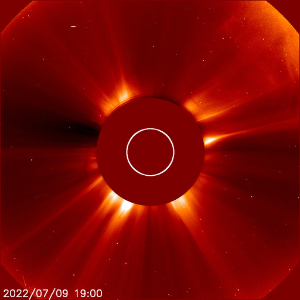

# Archive: July 2022

List of archived image observations from LASCO C2 and LASCO C3 published on Space Weather Prediction Center [website](https://www.swpc.noaa.gov/products/lasco-coronagraph) during the month July 2022.

### 2022-07-13

    

### 2022-07-09

        
