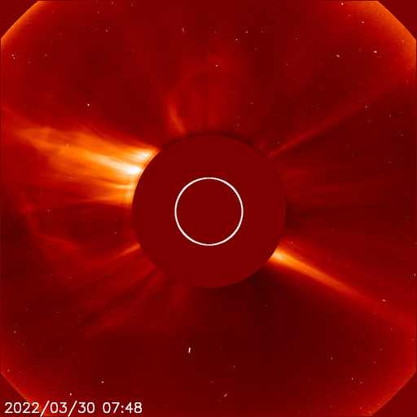
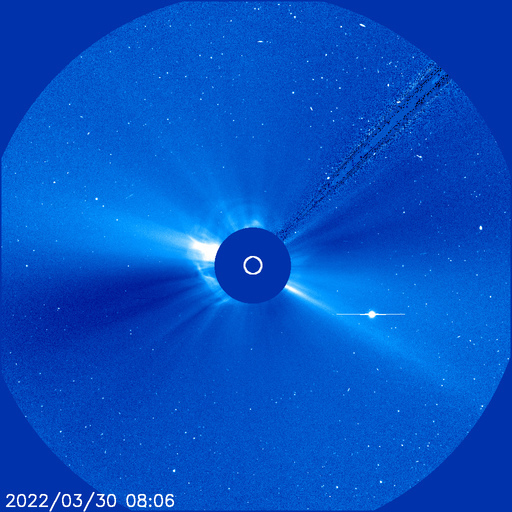
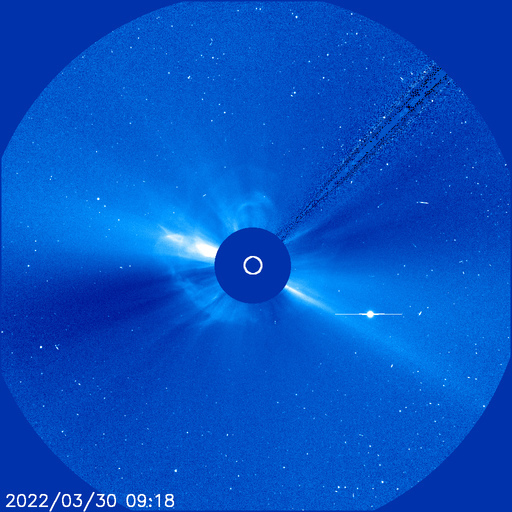
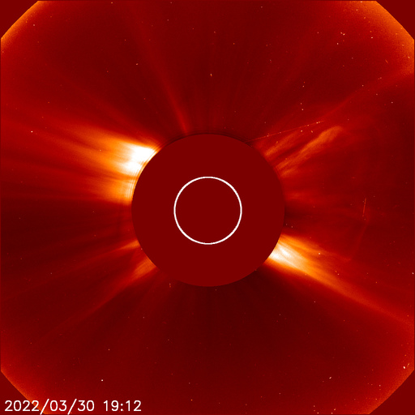
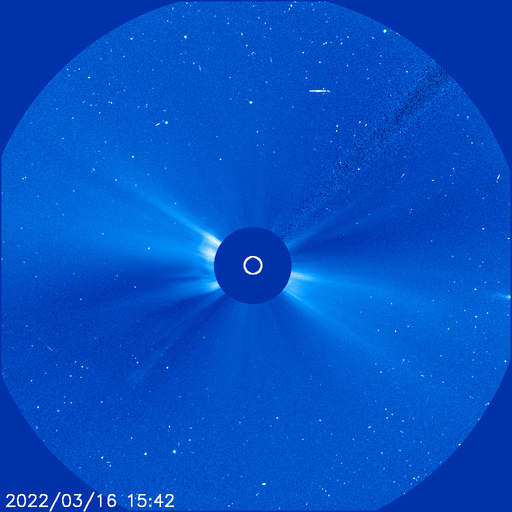

# Archive: March 2022

List of archived image observations from LASCO C2 and LASCO C3 published on Space Weather Prediction Center [website](https://www.swpc.noaa.gov/products/lasco-coronagraph) during the month March 2022.

### 2022-03-31

An M9.6 flare (R2 - Moderate Radio Blackout) occurred at 2:35 pm EDT (1835 UTC) March 31st, 2022. The source location was from the flare productive, magnetically complex sunspot group, Region 2975. This same sunspot group has been the source of multiple flares over the past few days, with the most notable, prior flares being an M4 (R1) on 28 March at 7:29 am EDT (28/1129 UTC) and a X1 (R3) on 30 March at 1:37 pm EDT (30/1737 UTC).

*CACTUS: <a href="https://www.sidc.be/cactus/catalog/LASCO/2_5_0/qkl/2022/03/CME0107/CME.html">CME0107</a> // SEEDS: <a href="http://spaceweather.gmu.edu/seeds/dailymkmovie.php?cme=20220331&r&cor2=a">COR2</a> & <a href="http://spaceweather.gmu.edu/seeds/dailymkmovie.php?cme=20220331&cor2=a">COR2A</a>*

         

### 2022-03-30

An X1 flare (R3 - Strong Radio Blackout) occurred at 1:37 pm EDT (1737 UTC) March 30th, 2022. The flare source location was from the magnetically complex sunspot group, Region 2975.

*CACTUS: <a href="https://www.sidc.be/cactus/catalog/LASCO/2_5_0/qkl/2022/03/CME0095/CME.html">CME0095</a>, <a href="https://www.sidc.be/cactus/catalog/LASCO/2_5_0/qkl/2022/03/CME0104/CME.html">CME0104</a> // SEEDS: <a href="http://spaceweather.gmu.edu/seeds/dailymkmovie.php?cme=20220330&r&cor2=a">COR2</a> & <a href="http://spaceweather.gmu.edu/seeds/dailymkmovie.php?cme=20220330&cor2=a">COR2A</a>*

                    

### 2022-03-28

An S1 (Minor) solar radiation storm began on 28 March, 2022, at 9:25 am EDT (1325 UTC). This event was associated with an M4 flare nearly 2 hours earlier at 7:29 am EDT (1129 UTC). The flare source location was a magnetically complex sunspot group, Region 2975.

*CACTUS: <a href="https://www.sidc.be/cactus/catalog/LASCO/2_5_0/qkl/2022/03/CME0090/CME.html">CME0090</a> // SEEDS: <a href="http://spaceweather.gmu.edu/seeds/dailymkmovie.php?cme=20220328&r&cor2=a">COR2</a> & <a href="http://spaceweather.gmu.edu/seeds/dailymkmovie.php?cme=20220328&cor2=a">COR2A</a>*

                    

### 2022-03-21

*CACTUS: <a href="https://www.sidc.be/cactus/catalog/LASCO/2_5_0/qkl/2022/03/CME0069/CME.html">CME0069</a> // SEEDS: <a href="http://spaceweather.gmu.edu/seeds/dailymkmovie.php?cme=20220321&r&cor2=a">COR2</a> & <a href="http://spaceweather.gmu.edu/seeds/dailymkmovie.php?cme=20220321&cor2=a">COR2A</a>*

                   

### 2022-03-17

*CACTUS: <a href="https://www.sidc.be/cactus/catalog/LASCO/2_5_0/qkl/2022/03/CME0059/CME.html">CME0059</a> // SEEDS: <a href="http://spaceweather.gmu.edu/seeds/dailymkmovie.php?cme=20220317&r&cor2=a">COR2</a> & <a href="http://spaceweather.gmu.edu/seeds/dailymkmovie.php?cme=20220317&cor2=a">COR2A</a>*

     

### 2022-03-16

*CACTUS: <a href="https://www.sidc.be/cactus/catalog/LASCO/2_5_0/qkl/2022/03/CME0055/CME.html">CME0055</a>, <a href="https://www.sidc.be/cactus/catalog/LASCO/2_5_0/qkl/2022/03/CME0056/CME.html">CME0056</a> // SEEDS: <a href="http://spaceweather.gmu.edu/seeds/dailymkmovie.php?cme=20220316&r&cor2=a">COR2</a> & <a href="http://spaceweather.gmu.edu/seeds/dailymkmovie.php?cme=20220316&cor2=a">COR2A</a>*

                

### 2022-03-14

*CACTUS: <a href="https://www.sidc.be/cactus/catalog/LASCO/2_5_0/qkl/2022/03/CME0050/CME.html">CME0050</a>, <a href="https://www.sidc.be/cactus/catalog/LASCO/2_5_0/qkl/2022/03/CME0052/CME.html">CME0052</a> // SEEDS: <a href="http://spaceweather.gmu.edu/seeds/dailymkmovie.php?cme=20220314&r&cor2=a">COR2</a> & <a href="http://spaceweather.gmu.edu/seeds/dailymkmovie.php?cme=20220314&cor2=a">COR2A</a>*

                    

### 2022-03-10

*CACTUS: <a href="https://www.sidc.be/cactus/catalog/LASCO/2_5_0/qkl/2022/03/CME0034/CME.html">CME0034</a> // SEEDS: <a href="http://spaceweather.gmu.edu/seeds/dailymkmovie.php?cme=20220310&r&cor2=a">COR2</a> & <a href="http://spaceweather.gmu.edu/seeds/dailymkmovie.php?cme=20220310&cor2=a">COR2A</a>*

         

### 2022-03-08

*CACTUS: <a href="https://www.sidc.be/cactus/catalog/LASCO/2_5_0/qkl/2022/03/CME0026/CME.html">CME0026</a> // SEEDS: <a href="http://spaceweather.gmu.edu/seeds/dailymkmovie.php?cme=20220308&r&cor2=a">COR2</a> & <a href="http://spaceweather.gmu.edu/seeds/dailymkmovie.php?cme=20220308&cor2=a">COR2A</a>*

    

### 2022-03-07

*CACTUS: <a href="https://www.sidc.be/cactus/catalog/LASCO/2_5_0/qkl/2022/03/CME0023/CME.html">CME0023</a> // SEEDS: <a href="http://spaceweather.gmu.edu/seeds/dailymkmovie.php?cme=20220307&r&cor2=a">COR2</a> & <a href="http://spaceweather.gmu.edu/seeds/dailymkmovie.php?cme=20220307&cor2=a">COR2A</a>*

    

### 2022-03-05

*CACTUS: <a href="https://www.sidc.be/cactus/catalog/LASCO/2_5_0/qkl/2022/03/CME0012/CME.html">CME0012</a> // SEEDS: <a href="http://spaceweather.gmu.edu/seeds/dailymkmovie.php?cme=20220305&r&cor2=a">COR2</a> & <a href="http://spaceweather.gmu.edu/seeds/dailymkmovie.php?cme=20220305&cor2=a">COR2A</a>*

    

### 2022-03-01

*CACTUS: <a href="https://www.sidc.be/cactus/catalog/LASCO/2_5_0/qkl/2022/03/CME0002/CME.html">CME0002</a> // SEEDS: <a href="http://spaceweather.gmu.edu/seeds/dailymkmovie.php?cme=20220301&r&cor2=a">COR2</a> & <a href="http://spaceweather.gmu.edu/seeds/dailymkmovie.php?cme=20220301&cor2=a">COR2A</a>*

         
