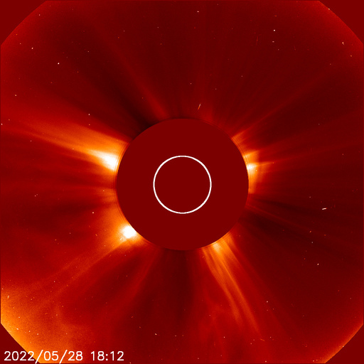
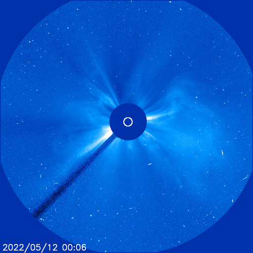
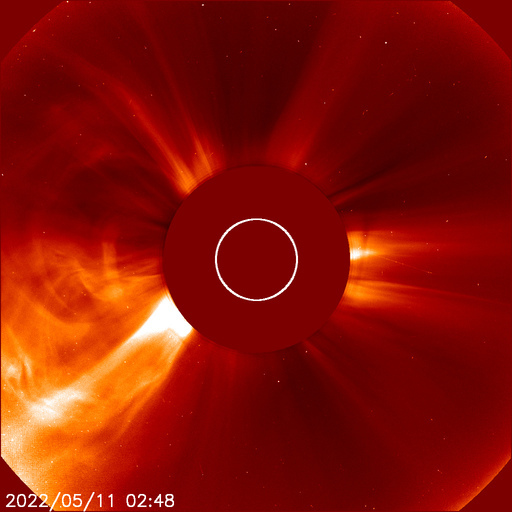
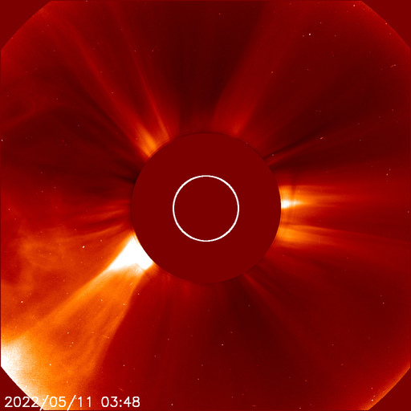
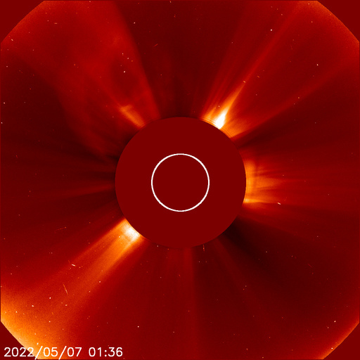

# Archive: May 2022

List of archived image observations from LASCO C2 and LASCO C3 published on Space Weather Prediction Center [website](https://www.swpc.noaa.gov/products/lasco-coronagraph) during the month May 2022.

### 2022-05-28

*CACTUS: <a href="https://www.sidc.be/cactus/catalog/LASCO/2_5_0/qkl/2022/05/CME0172/CME.html">CME0172</a> // SEEDS: <a href="http://spaceweather.gmu.edu/seeds/dailymkmovie.php?cme=20220528&r&cor2=a">COR2</a> & <a href="http://spaceweather.gmu.edu/seeds/dailymkmovie.php?cme=20220528&cor2=a">COR2A</a>*

            

### 2022-05-25

*CACTUS: <a href="https://www.sidc.be/cactus/catalog/LASCO/2_5_0/qkl/2022/05/CME0154/CME.html">CME0154</a>, <a href="https://www.sidc.be/cactus/catalog/LASCO/2_5_0/qkl/2022/05/CME0157/CME.html">CME0157</a>, <a href="https://www.sidc.be/cactus/catalog/LASCO/2_5_0/qkl/2022/05/CME0162/CME.html">CME0162</a> // SEEDS: <a href="http://spaceweather.gmu.edu/seeds/dailymkmovie.php?cme=20220525&r&cor2=a">COR2</a> & <a href="http://spaceweather.gmu.edu/seeds/dailymkmovie.php?cme=20220525&cor2=a">COR2A</a>*

                  

### 2022-05-24

*CACTUS: <a href="https://www.sidc.be/cactus/catalog/LASCO/2_5_0/qkl/2022/05/CME0148/CME.html">CME0148</a> // SEEDS: <a href="http://spaceweather.gmu.edu/seeds/dailymkmovie.php?cme=20220524&r&cor2=a">COR2</a> & <a href="http://spaceweather.gmu.edu/seeds/dailymkmovie.php?cme=20220524&cor2=a">COR2A</a>*

    

### 2022-05-23

### 2022-05-21

*CACTUS: <a href="https://www.sidc.be/cactus/catalog/LASCO/2_5_0/qkl/2022/05/CME0126/CME.html">CME0126</a> // SEEDS: <a href="http://spaceweather.gmu.edu/seeds/dailymkmovie.php?cme=20220521&r&cor2=a">COR2</a> & <a href="http://spaceweather.gmu.edu/seeds/dailymkmovie.php?cme=20220521&cor2=a">COR2A</a>*

      

### 2022-05-13

*CACTUS: <a href="https://www.sidc.be/cactus/catalog/LASCO/2_5_0/qkl/2022/05/CME0091/CME.html">CME0091</a>, <a href="https://www.sidc.be/cactus/catalog/LASCO/2_5_0/qkl/2022/05/CME0094/CME.html">CME0094</a> // SEEDS: <a href="http://spaceweather.gmu.edu/seeds/dailymkmovie.php?cme=20220513&r&cor2=a">COR2</a> & <a href="http://spaceweather.gmu.edu/seeds/dailymkmovie.php?cme=20220513&cor2=a">COR2A</a>*

          

### 2022-05-11

*CACTUS: <a href="https://www.sidc.be/cactus/catalog/LASCO/2_5_0/qkl/2022/05/CME0071/CME.html">CME0071</a> // SEEDS: <a href="http://spaceweather.gmu.edu/seeds/dailymkmovie.php?cme=20220511&r&cor2=a">COR2</a> & <a href="http://spaceweather.gmu.edu/seeds/dailymkmovie.php?cme=20220511&cor2=a">COR2A</a>*

         

### 2022-05-10

*CACTUS: <a href="https://www.sidc.be/cactus/catalog/LASCO/2_5_0/qkl/2022/05/CME0062/CME.html">CME0062</a> // SEEDS: <a href="http://spaceweather.gmu.edu/seeds/dailymkmovie.php?cme=20220510&r&cor2=a">COR2</a> & <a href="http://spaceweather.gmu.edu/seeds/dailymkmovie.php?cme=20220510&cor2=a">COR2A</a>*

                   

### 2022-05-08

*CACTUS: <a href="https://www.sidc.be/cactus/catalog/LASCO/2_5_0/qkl/2022/05/CME0051/CME.html">CME0051</a> // SEEDS: <a href="http://spaceweather.gmu.edu/seeds/dailymkmovie.php?cme=20220508&r&cor2=a">COR2</a> & <a href="http://spaceweather.gmu.edu/seeds/dailymkmovie.php?cme=20220508&cor2=a">COR2A</a>*

         

### 2022-05-06

*CACTUS: <a href="https://www.sidc.be/cactus/catalog/LASCO/2_5_0/qkl/2022/05/CME0044/CME.html">CME0044</a> // SEEDS: <a href="http://spaceweather.gmu.edu/seeds/dailymkmovie.php?cme=20220506&r&cor2=a">COR2</a> & <a href="http://spaceweather.gmu.edu/seeds/dailymkmovie.php?cme=20220506&cor2=a">COR2A</a>*

    

### 2022-05-05

*CACTUS: <a href="https://www.sidc.be/cactus/catalog/LASCO/2_5_0/qkl/2022/05/CME0038/CME.html">CME0038</a> // SEEDS: <a href="http://spaceweather.gmu.edu/seeds/dailymkmovie.php?cme=20220505&r&cor2=a">COR2</a> & <a href="http://spaceweather.gmu.edu/seeds/dailymkmovie.php?cme=20220505&cor2=a">COR2A</a>*

    

### 2022-05-01

*CACTUS: <a href="https://www.sidc.be/cactus/catalog/LASCO/2_5_0/qkl/2022/05/CME0003/CME.html">CME0003</a>, <a href="https://www.sidc.be/cactus/catalog/LASCO/2_5_0/qkl/2022/05/CME0004/CME.html">CME0004</a> // SEEDS: <a href="http://spaceweather.gmu.edu/seeds/dailymkmovie.php?cme=20220501&r&cor2=a">COR2</a> & <a href="http://spaceweather.gmu.edu/seeds/dailymkmovie.php?cme=20220501&cor2=a">COR2A</a>*

              
